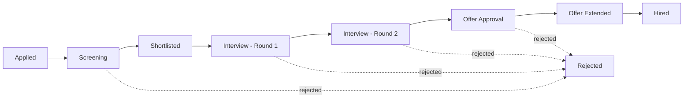
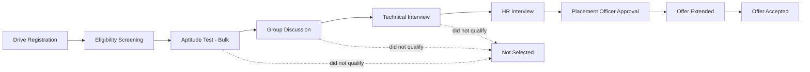
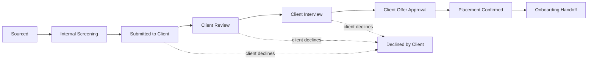

# AgnoHire Next-Gen — Functional Specification Document

**Status:** Draft for review
**Companion documents:** `NEXTGEN_TSD.md` (Technical Spec), `NEXTGEN_SOLUTION_BLUEPRINT.md` (Solution Blueprint) — all three are drafted from the same shared context pack and use identical terminology (Account, Company, Workspace, Workflow Designer, Connector Marketplace, Dynamic Module Framework, Template Management, AI Gateway). This document defines *what* the platform must do; the TSD defines *how* it is built.

---

## 1. Business Vision

AgnoHire is not a green-field product. It is a live, deployed ATS/recruitment SaaS platform with Jobs/Requisitions, Candidates, Applications/Pipeline, Interviews (AI-assisted question banks, ML-based proctoring), Offers (including a tentative-offer flow and document portal), Assessments (Monaco-based coding + MCQ), Analytics, Audit Logs, Compliance/GDPR tooling, a full Admin module, SaaS/Billing on Razorpay, and — notably — a complete Campus/University Recruitment module (drives, internships, alumni, certificates, leaderboards). Public/candidate-facing flows already exist via signed tokens (careers page, application portal, interview-take, assessment-take pages). This functioning breadth is the starting point for Next-Gen, not a target to rebuild.

What AgnoHire does **not** yet offer is *configurability without engineering involvement*. Every new customer's pipeline stages, approval chains, integrations, notification templates, and industry-specific workflows today require code changes, redeploys, or bespoke development. The Campus Recruitment module proves the underlying platform already generalizes beyond a single hiring process — but that generalization was achieved by writing a new module, not by configuring the existing one.

**AgnoHire Next-Gen's business goal is to make that generalization a first-class, self-service capability of the core platform**, powered by a centralized, AgnoHire-managed n8n instance, so that:

- A new customer's entire hiring process, approval structure, notification set, and integration stack can be configured and go live **without a single application deployment**.
- The 20 integration provider wizards already shipped (WhatsApp, Slack, Teams, LinkedIn, Naukri, Indeed, Salesforce, Workday, BambooHR, ADP, and others) evolve from a fixed, developer-maintained catalog into a self-service **Connector Marketplace** any Account Administrator can browse and enable.
- Net-new business lines described in the vision — Agency/Staffing, Vendor Management, Internal Hiring, Executive Search, LMS, Alumni, CRM, Helpdesk, Compliance, industry verticals — ship as **configuration on top of a Dynamic Module Framework**, the same way Campus Recruitment proved the concept manually.
- The existing tenancy model (a single-level `Tenant`, isolated end-to-end via Postgres RLS + Prisma middleware + `AsyncLocalStorage` propagation — already solid, defense-in-depth, not a gap to fix) is extended, not replaced, to a three-level **Account → Company → Workspace** hierarchy that matches how real enterprise, agency, and franchise customers are structured.

This is deliberately an **evolution, not a rewrite**: the modular monolith stays a modular monolith; native recruitment modules stay native and hand-optimized; the existing `TenantRolePermission` override mechanism, `PaymentProvider` abstraction, and `IntegrationProviderDef` wizard pattern are precedents that Next-Gen extends rather than discards. Every migration is additive, in the same spirit as `SAAS_MIGRATION_RUNBOOK.md`: existing functionality does not change, and the frontend a current customer already knows keeps working while new configurability is layered underneath and around it.

---

## 2. Functional Requirements

Requirements are grouped by the six capability areas of the vision and use "shall" statements with stable FR-IDs for traceability into design and test artifacts.

### 2.1 AgnoHire Core Platform (FR-CORE)

- **FR-CORE-01**: The system shall support a three-level tenancy hierarchy — Account, Company, Workspace — where every Account has one or more Companies, and every Company has one or more Workspaces.
- **FR-CORE-02**: The system shall scope all recruitment data (Jobs, Candidates, Applications, Interviews, Offers, Assessments, etc.) at the Workspace level, with Account-level and Company-level roll-up views available to authorized roles.
- **FR-CORE-03**: The system shall allow a user to be granted role-based access to a subset of Companies/Workspaces within a single Account (not necessarily all of them), supporting multi-client agency and franchise scenarios.
- **FR-CORE-04**: The system shall preserve the existing Role/Permission/`RolePermission` model and the `TenantRolePermission`-style per-tenant override mechanism, re-scoped to Account/Workspace as applicable.
- **FR-CORE-05**: The system shall ship a Default Recruitment Workflow, pre-configured and usable with zero configuration for any new Workspace.
- **FR-CORE-06**: The system shall continue to enforce JWT-based authentication, Google OAuth, and existing Audit Log, Notification, and Reporting/Analytics capabilities without functional regression during and after the tenancy re-scoping.
- **FR-CORE-07**: The system shall provide an Administration Module allowing Account Administrators to manage Companies, Workspaces, Users, Roles, and platform-level settings from a single console.

### 2.2 Centralized n8n Platform (FR-N8N)

- **FR-N8N-01**: The system shall operate a single, centrally managed n8n instance shared across all Accounts; no customer shall receive a dedicated n8n installation.
- **FR-N8N-02**: The system shall provision a dedicated n8n Project for every Account, with credentials, variables, and workflows isolated to that Project.
- **FR-N8N-03**: The system shall automatically provision the default set of workflows (from the Default Recruitment Workflow and any enabled connectors) into a new Account's n8n Project at Account creation time, with no manual n8n administration step.
- **FR-N8N-04**: The system shall never expose the native n8n editor UI to tenant users; all workflow configuration shall occur through AgnoHire's own Workflow Designer.
- **FR-N8N-05**: The system shall dispatch domain events (e.g., job-stage-changed, application-submitted, offer-signed) to the correct Account's n8n Project only, with no cross-Account event leakage.
- **FR-N8N-06**: The system shall require n8n-triggered data reads/writes to occur through AgnoHire's authenticated internal API; n8n shall never be granted direct database access.

### 2.3 Hiring Workflow Customization (FR-WFD)

- **FR-WFD-01**: The system shall provide a visual Workflow Designer allowing an Account Administrator to create, rename, reorder, and remove pipeline stages for a Workspace without code changes.
- **FR-WFD-02**: The system shall allow stage transitions to carry SLA timers, and shall notify configured roles when an SLA is breached.
- **FR-WFD-03**: The system shall allow an Account Administrator to attach automation rules to a stage transition, including notifications, AI-based decision nodes, conditional branching, parallel execution branches, task assignment, and multi-step approval chains with escalation.
- **FR-WFD-04**: The system shall allow approval chains to be configured with an ordered or parallel list of approver roles/users, each with an approve/reject/delegate action and configurable timeout/escalation behavior.
- **FR-WFD-05**: The system shall compile Workflow Designer graphs into n8n workflow definitions and publish them into the owning Account's n8n Project without requiring an application deployment.
- **FR-WFD-06**: The system shall allow a Workflow Designer configuration to be saved as a draft, validated, and published independently, so in-progress edits do not affect the live pipeline.
- **FR-WFD-07**: The system shall version every published workflow and allow an Account Administrator to view history and roll back to a prior version.

### 2.4 Connector Marketplace (FR-CONN)

- **FR-CONN-01**: The system shall present a catalog of available connectors (communication, job boards, CRM, HRMS, payroll, calendar, Google Workspace, M365, AI services, document storage, generic REST/Webhook, and any n8n-supported application) organized by category.
- **FR-CONN-02**: The system shall allow an Account Administrator to enable a connector for their Account and complete its configuration through a guided wizard, without developer involvement.
- **FR-CONN-03**: Enabling a connector shall provision the corresponding credential type inside the Account's n8n Project automatically.
- **FR-CONN-04**: The system shall allow a connector to be disabled, which shall deactivate (not delete) its associated workflows and credentials, preserving configuration for re-enablement.
- **FR-CONN-05**: The system shall support onboarding a new connector by adding a manifest entry (a `ConnectorDefinition`) rather than by shipping new application code, for any connector already supported natively by n8n.
- **FR-CONN-06**: The system shall migrate the 20 existing integration provider wizards (WhatsApp, Teams, Slack, LinkedIn, Naukri, Indeed, Salesforce, Workday, BambooHR, ADP, etc.) into the Connector Marketplace catalog as its initial seed set, preserving each wizard's existing configuration UX.

### 2.5 Template Management (FR-TPL)

- **FR-TPL-01**: The system shall allow authorized Admins/Workspace Users to create, edit, preview, and publish templates across Email, WhatsApp, SMS, Push, and in-app Notification channels.
- **FR-TPL-02**: The system shall provide purpose-built template categories including Interview Invite, Offer Letter, Rejection, Assessment Invite, Reminder, and Approval Notification, in addition to Custom templates.
- **FR-TPL-03**: The system shall support dynamic variables resolved against a per-trigger-event template context schema (e.g., candidate name, job title, interview slot).
- **FR-TPL-04**: The system shall support conditional content blocks within a template (e.g., show a section only if a field is present).
- **FR-TPL-05**: The system shall support multiple language variants of the same logical template, selected at send-time by candidate/recipient locale.
- **FR-TPL-06**: The system shall version every template edit and allow reverting to a previous version.
- **FR-TPL-07**: The system shall support a draft → in review → approved → published approval workflow for template changes, with configurable required approver roles.
- **FR-TPL-08**: The system shall provide a rich text editor with live preview against sample data before publishing.

### 2.6 Fully Configurable Business Platform (FR-DMF)

- **FR-DMF-01**: The system shall allow an authorized administrator to define a new business module (name, icon, category) without code changes, using the Dynamic Module Framework.
- **FR-DMF-02**: The system shall allow definition of custom entities with custom fields (text, number, date, select, relation, file, etc.) scoped to a module.
- **FR-DMF-03**: The system shall allow definition of forms bound to an entity, with field-level validation and layout, rendered by a generic form runtime.
- **FR-DMF-04**: The system shall allow definition of navigation menu items that expose a module's entities/dashboards to authorized users.
- **FR-DMF-05**: The system shall allow definition of dashboards and reports composed from entity data, using configurable widgets/visualizations.
- **FR-DMF-06**: The system shall allow definition of permissions scoped to a dynamic module's entities, integrated with the platform's existing Role/Permission model.
- **FR-DMF-07**: The system shall allow a dynamic module's entities to participate in Workflow Designer automation (as trigger sources and as data read/write targets via the AI Gateway/internal API), and to be exposed via generated REST APIs.
- **FR-DMF-08**: The system shall keep native recruitment modules (Jobs, Candidates, Interviews, Offers, Assessments, Analytics) on their existing hand-built implementation; the Dynamic Module Framework shall not be a prerequisite for using the core platform.
- **FR-DMF-09**: The system shall version a Dynamic Module's metadata definitions per Account and support safe iteration (draft/publish) without affecting other Accounts.

---

## 3. User Stories

Grouped by capability area; personas correspond to the platform's roles: Platform Superadmin, Account Admin, Company Admin, Workspace Admin/HR, Recruiter, Hiring Manager, Panel Member, Candidate, Template Editor, Workflow Designer author.

### Core Platform / Tenancy

- As a **Platform Superadmin**, I want to view and manage all Accounts, Companies, and Workspaces across the platform, so that I can support customers and monitor overall platform health.
- As an **Account Admin**, I want to create additional Companies under my Account, so that I can model distinct legal entities or client engagements (e.g., a staffing group's client roster) separately.
- As an **Account Admin**, I want to create multiple Workspaces under a Company, so that different business units, brands, or regions can run independent hiring pipelines with their own data isolation.
- As a **Company Admin**, I want a consolidated view of hiring activity across all Workspaces in my Company, so that I can report to leadership without switching contexts repeatedly.
- As a **Workspace Admin/HR**, I want my Workspace to work correctly out-of-the-box with the Default Recruitment Workflow, so that I can start hiring on day one before customizing anything.

### Hiring Workflow Customization

- As an **Account Admin**, I want to add a new pipeline stage (e.g., "Panel Round 2") between two existing stages, so that my process matches our actual hiring steps without asking engineering for a change.
- As a **Workflow Designer author**, I want to attach an AI-based decision node to a stage transition that scores a candidate's resume against the job description, so that recruiters get an automatic fit signal before manual review.
- As a **Recruiter**, I want to configure an SLA timer on the "Awaiting Manager Feedback" stage with an automatic reminder notification, so that hiring managers don't sit on candidates for too long.
- As a **Hiring Manager**, I want to be part of a multi-step approval chain for offers above a salary threshold, so that compensation decisions get the right sign-off before an offer letter is generated.
- As a **Panel Member**, I want to receive a task assignment automatically when a candidate enters the interview stage, so that I know exactly what I'm responsible for without a recruiter manually pinging me.
- As an **Account Admin**, I want to publish a workflow change and see it take effect immediately for new candidates, so that I never have to wait for a deployment window.

### Connector Marketplace

- As an **Account Admin**, I want to browse a catalog of connectors organized by category (communication, job boards, CRM, HRMS, etc.), so that I can quickly find and enable only what my organization needs.
- As an **Account Admin**, I want to enable WhatsApp notifications through a guided wizard, so that candidates receive interview reminders on the channel they actually check.
- As a **Company Admin**, I want to connect our existing HRMS (e.g., Workday or BambooHR) so that hired candidates sync automatically into the HR system of record without manual re-entry.
- As an **Account Admin**, I want to disable a connector we no longer use, so that we reduce risk surface and clutter without losing the historical configuration if we re-enable it later.
- As a **Recruiter**, I want job postings I publish to automatically syndicate to Naukri, LinkedIn, and Indeed once those connectors are enabled, so that I don't have to post the same job three times manually.

### Template Management

- As a **Template Editor**, I want to create an Interview Invite template with dynamic variables for candidate name, interview time, and panel names, so that every invite is personalized without manual editing.
- As a **Template Editor**, I want to preview a template against sample candidate data before publishing, so that I catch formatting or variable errors before candidates see them.
- As a **Workspace Admin/HR**, I want an offer letter template change to go through an approval step before it goes live, so that legal/compliance can review wording changes.
- As a **Template Editor**, I want to maintain English and Spanish variants of the same Rejection template, so that candidates receive communication in their preferred language.
- As an **Account Admin**, I want to see the version history of a template, so that I can revert a change that introduced an error.

### Dynamic Module Framework / Configurable Business Platform

- As an **Account Admin** running a staffing agency, I want to define a "Client Company" entity with custom fields (contract type, markup rate, account owner) that doesn't exist in core recruitment, so that I can manage client relationships inside AgnoHire.
- As an **Account Admin**, I want to expose a new dynamic module in the navigation menu only to the roles that need it, so that unrelated users aren't confused by modules they don't use.
- As a **Workspace Admin**, I want a custom dashboard showing metrics from a dynamic "Vendor Management" module alongside standard recruitment analytics, so that I get one unified reporting view.
- As an **Account Admin**, I want a dynamic module's entity to trigger a Workflow Designer automation (e.g., notify a vendor manager when a new vendor record is submitted), so that net-new business processes get the same automation power as core recruitment.
- As a **Platform Superadmin**, I want to see which Accounts have created custom dynamic modules and how heavily they're used, so that we can identify candidates for promoting a popular custom module into a first-class platform module.

### Candidate-Facing

- As a **Candidate**, I want to receive interview and offer communications on the channel my recruiter enabled (email, WhatsApp, SMS), so that I don't miss important updates.
- As a **Candidate**, I want to apply to a job through the public careers page regardless of how the hiring organization has customized its internal workflow, so that customization on the back end never breaks my experience.

---

## 4. Module Specifications

### 4.1 Account / Company / Workspace Management

**Purpose**: Model the customer hierarchy and be the scoping backbone for every other module.
**Key entities**: `Account` (renamed from today's `Tenant`; retains `slug`, `status`, `approvalStatus`, `planId`, billing fields), `Company` (new, FK to `Account`), `Workspace` (new, FK to `Company`, with `accountId` denormalized for fast roll-up queries).
**Key screens/flows**: Account settings console; Company list/detail with Workspace management; Workspace creation wizard (choose Default Recruitment Workflow or clone an existing Workspace's configuration); cross-Workspace admin/reporting switcher.
**Dependencies**: Billing/entitlements (Account-level), Role/Permission assignment (scoped to Company/Workspace), n8n Project provisioning (one per Account), RLS/Prisma middleware tenancy enforcement (re-keyed to `workspaceId`).

### 4.2 User & Role Management

**Purpose**: Authentication, authorization, and per-Company/Workspace access scoping.
**Key entities**: `User`, `Role`, `Permission`, `RolePermission`, `TenantRolePermission`-style override (re-scoped), plus a new access-grant join model linking Users to specific Companies/Workspaces with a Role.
**Key screens/flows**: User invite/list/detail; role assignment per Company/Workspace; permission override editor for Account Admins.
**Dependencies**: JWT/session issuance carries Account + effective Workspace scope; consumed by every other module's authorization checks.

### 4.3 Workflow Designer

**Purpose**: The visual authoring surface for both the native stage/SLA layer and the n8n-backed automation layer of hiring customization.
**Key entities**: `StageDefinition`, `TransitionRule` (native, per Workspace), plus the automation graph that compiles into n8n workflow JSON published into the Account's n8n Project.
**Key screens/flows**: Drag-and-drop stage editor (native layer); canvas-based automation editor with a simplified node palette (notification, AI decision, condition, parallel branch, approval, task assignment, connector action); draft/publish workflow with version history and rollback.
**Dependencies**: Connector Marketplace (automation nodes that call connectors), AI Gateway (AI decision nodes), Template Management (notification nodes reference `TemplateDefinition`s), Centralized n8n Platform (compilation/execution target), domain event emission from core recruitment modules.

### 4.4 Connector Marketplace

**Purpose**: Self-service catalog and configuration surface for third-party integrations.
**Key entities**: `ConnectorDefinition` (metadata catalog: auth type, config schema, n8n credential-type/node-template mapping, category, icon), plus the existing `Integration` and `WebhookLog` models carrying per-Account enablement/configuration state.
**Key screens/flows**: Category-organized catalog browser; per-connector configuration wizard (reusing the existing `IntegrationProviderDef` wizard pattern: `getWizardSteps`/`getDefaultState`/`getSavePayload`); enable/disable toggle.
**Dependencies**: Centralized n8n Platform (credential provisioning), Workflow Designer (connectors surface as automation nodes).

### 4.5 Template Management

**Purpose**: Multi-channel, versioned, approvable communication templates.
**Key entities**: `TemplateDefinition`, `TemplateVersion` (generalizing today's Email Template model to email/WhatsApp/SMS/push, with category, language variants, and approval state).
**Key screens/flows**: Template library by category; rich text/variable editor with live preview against sample data; approval workflow (draft → in review → approved → published); version history/rollback.
**Dependencies**: Workflow Designer (notification automation nodes select a `TemplateDefinition`), Connector Marketplace (channel delivery), AI Gateway (optional AI-assisted drafting).

### 4.6 Dynamic Module Builder

**Purpose**: Metadata-driven runtime for net-new business modules without application code.
**Key entities**: `ModuleDefinition`, `EntityDefinition`, `FieldDefinition`, `FormDefinition`, `MenuDefinition`, `DashboardDefinition`, `ReportDefinition`, `PermissionDefinition` — all versioned per Account.
**Key screens/flows**: Module builder (define module → entities → fields); form builder bound to an entity; menu/dashboard/report composer; publish/version control per module.
**Dependencies**: User & Role Management (dynamic `PermissionDefinition` integrates with core RBAC), Workflow Designer (dynamic entities as trigger/target), Reporting/Analytics (dynamic reports render alongside native ones).

### 4.7 AI Services

**Purpose**: Provider-abstracted AI capability layer for both interactive features and Workflow Designer automation.
**Key entities**: AI Gateway (service abstraction analogous to the existing `PaymentProvider` pattern), request/response audit records.
**Key screens/flows**: AI Playground (existing admin capability, extended); AI decision node configuration inside Workflow Designer; inline AI suggestions in JD authoring and resume review.
**Dependencies**: Workflow Designer (AI decision nodes), Audit Logs (every AI call logged), core recruitment modules (resume parsing/scoring, interview answer analysis consume Candidate/Interview data).

### 4.8 Notifications

**Purpose**: Multi-channel delivery of system and template-driven communications.
**Key entities**: existing `Notification` model, extended to reference `TemplateDefinition`/`TemplateVersion` and delivery channel.
**Key screens/flows**: Notification Center (existing, extended with channel status); per-user notification preferences.
**Dependencies**: Template Management, Connector Marketplace (channel delivery), Workflow Designer (notification automation nodes).

### 4.9 Audit Logs

**Purpose**: Immutable record of configuration and data changes across the now-configurable platform.
**Key entities**: existing `AuditLog` model, extended to capture Workflow Designer publishes, Connector enable/disable, Template approvals, and Dynamic Module publishes as first-class event types.
**Key screens/flows**: existing Audit Log viewer, extended with filters for the new configuration event types.
**Dependencies**: every configuration-surface module (Workflow Designer, Connector Marketplace, Template Management, Dynamic Module Builder) emits audit events.

### 4.10 Reporting / Analytics

**Purpose**: Operational and configuration-usage reporting across Account/Company/Workspace scopes.
**Key entities**: existing Analytics models/snapshots, extended with Company/Workspace roll-up dimensions and Dynamic Module `ReportDefinition` data sources.
**Key screens/flows**: existing Analytics dashboards, extended with a Workspace/Company scope switcher and a "custom reports" section rendering `ReportDefinition`-based reports alongside native ones.
**Dependencies**: Account/Company/Workspace Management (scope dimension), Dynamic Module Builder (custom report definitions).

---

## 5. Workflow Definitions

### 5.1 Default Recruitment Workflow (out-of-the-box)

Every new Workspace is provisioned with this stage sequence and a baseline set of automations, usable immediately with zero configuration:

Baseline automations attached out-of-the-box: application-confirmation email on entry to *Applied*, resume-parsing/AI-scoring on entry to *Screening*, interview-invite template dispatch on entry to each Interview stage, single-approver approval on *Offer Approval* (default: Hiring Manager), and rejection-notice dispatch whenever a candidate transitions to *Rejected*. All of this is native `StageDefinition`/`TransitionRule` configuration plus pre-published automation workflows — an Account Admin can rename any stage or turn off any automation without engineering involvement.

### 5.2 Example customization — Campus Recruitment

The existing Campus Recruitment module (drives, internships, alumni, certificates, leaderboard) illustrates how a business-specific process differs from the default: it is organized around *drives* rather than individual requisitions, includes a bulk-shortlisting step, and layers a placement-officer approval before offers.

Differences from the default workflow, all expressed as configuration: the *Aptitude Test - Bulk* stage triggers a parallel-execution automation that assessment-invites an entire eligible cohort at once (rather than one candidate at a time); *Placement Officer Approval* is an additional approval-chain node inserted before offer issuance, routed to the University Admin cluster of roles rather than a Hiring Manager; and SLA timers are set in days-to-drive-close rather than per-candidate, reflecting the batch nature of campus hiring.

### 5.3 Example customization — Staffing / Agency

A staffing/agency Account, modeled with multiple client Companies under one Account, customizes the workflow to route candidates through a client-facing submission-and-approval step before any client-side interview occurs, and to attach a vendor/markup automation on placement.

Differences from the default workflow: *Submitted to Client* and *Client Review* are stages that do not exist in core recruitment at all — they are added purely through the native stage editor; *Client Offer Approval* is an approval chain with the Company (client) as an external stakeholder, invited via a connector-driven notification rather than an internal role; and *Placement Confirmed* triggers an automation rule that calls the agency's connected CRM/HRMS connector to record a billable placement and vendor markup, entirely via Workflow Designer automation nodes with no application code specific to staffing.

---

## 6. Permission Matrix

`Full` = create/edit/delete/publish; `Manage` = create/edit within own scope, no delete of others'/no cross-scope publish; `View` = read-only; `None` = no access.

| Capability / Action | Superadmin | Account Admin | Company Admin | Workspace Admin | HR | Recruiter | Hiring Manager | Panel Member | Candidate |
|---|---|---|---|---|---|---|---|---|---|
| Workflow Designer (edit/publish) | Full | Full | Manage | Manage | View | None | None | None | None |
| Connector Marketplace (enable/configure) | Full | Full | Manage | View | None | None | None | None | None |
| Template Management (create/publish) | Full | Full | Manage | Manage | Manage | View | None | None | None |
| Dynamic Module Builder | Full | Full | Manage | View | None | None | None | None | None |
| Billing / Plans | Full | Full | View | None | None | None | None | None | None |
| Audit Logs | Full | Full | Manage | View | View | None | None | None | None |
| User & Role Management | Full | Full | Manage | Manage | View | None | None | None | None |
| Account/Company/Workspace creation | Full | Manage (Company/Workspace) | Manage (Workspace) | None | None | None | None | None | None |
| Job Requisition create/edit | Full | Full | Manage | Manage | Manage | Manage | View | None | None |
| Candidate pipeline stage moves | Full | Full | Manage | Manage | Manage | Manage | Manage | View | None |
| Interview scheduling | Full | Full | Manage | Manage | Manage | Manage | View | View | View (own) |
| Interview scoring/feedback | Full | Full | View | View | View | View | Manage | Manage | None |
| Offer approval (per chain role) | Full | Full | View | View | View | View | Manage | None | View (own) |
| Offer issuance | Full | Full | Manage | Manage | Manage | Manage | None | None | View (own) |
| Assessment authoring | Full | Full | Manage | Manage | Manage | Manage | None | None | None |
| Application submission | N/A | N/A | N/A | N/A | N/A | N/A | N/A | N/A | Full (own) |
| Analytics/Reporting (Account scope) | Full | Full | View | None | None | None | None | None | None |
| Analytics/Reporting (Workspace scope) | Full | Full | View | Manage | View | View | View | None | None |

---

## 7. Configuration Capabilities

Everything below is achievable through admin UI configuration/metadata, with no code change or application deployment.

| Configurable Item | Configured By | Scope |
|---|---|---|
| Pipeline stages (add/rename/reorder/remove) | Account Admin, Workspace Admin | Workspace |
| Stage SLA timers | Account Admin, Workspace Admin | Workspace |
| Approval chains (order, escalation, timeout) | Account Admin | Workspace |
| Automation rules (notifications, branching, parallel execution, task assignment) | Account Admin, Workflow Designer author | Workspace (compiled into Account's n8n Project) |
| AI decision nodes | Account Admin, Workflow Designer author | Workspace |
| Connectors (enable/configure/disable) | Account Admin, Company Admin | Account (with Company-level credential scoping where applicable) |
| Templates (email/WhatsApp/SMS/push, incl. language variants) | Template Editor, Workspace Admin/HR | Workspace (with Account-level shared library) |
| Template approval workflow rules | Account Admin | Account |
| Dynamic modules, entities, fields | Account Admin, Company Admin | Account (published per Company/Workspace) |
| Dynamic forms | Account Admin, Company Admin | Account/Workspace |
| Dynamic menus | Account Admin | Account/Workspace |
| Dynamic dashboards/reports | Account Admin, Company Admin, Workspace Admin | Account/Company/Workspace |
| Roles and permission overrides | Account Admin | Account (assignable per Company/Workspace) |
| Notification rules (channel selection, quiet hours) | Account Admin, Workspace Admin | Workspace |
| Company/Workspace creation and structure | Account Admin | Account |

---

## 8. Integration Requirements

Functional-level requirements per connector category; technical protocol/credential design is deferred to the TSD.

- **WhatsApp / SMS**: Auth via API key or OAuth per provider (through the connector's n8n credential type). Data synced: outbound template-based messages (interview invites, reminders, offer notices); inbound delivery/read receipts where the provider supports webhooks. Triggering events: stage transitions with a notification automation node, manual resend from the candidate record.
- **Email**: Auth via SMTP credentials or provider API (e.g., existing email transport, extendable via connector). Data synced: outbound templated email; inbound bounce/open tracking where available. Triggering events: same as WhatsApp/SMS, plus system notifications (password reset, invite).
- **MS Teams / Slack**: Auth via OAuth app installation (existing wizards migrated into the Marketplace). Data synced: outbound approval requests and hiring notifications posted to channels/DMs; inbound approve/reject actions via interactive messages. Triggering events: approval-chain steps, SLA breach alerts.
- **Naukri / LinkedIn / Indeed**: Auth via provider API keys/OAuth (existing wizards). Data synced: outbound job posting syndication; inbound applicant data ingestion into the Applications pipeline. Triggering events: job publish/unpublish, job detail edits.
- **CRM (Salesforce, Zoho, SugarCRM, HubSpot, MS Dynamics 365)**: Auth via OAuth or API key. Data synced: candidate/client/vendor record sync (bi-directional where the CRM supports it). Triggering events: placement confirmation, client submission, new lead intake for agency scenarios.
- **HRMS / Payroll (Workday, BambooHR, SuccessFactors, Oracle HCM, UKG Pro, ADP)**: Auth via OAuth/API key per provider (existing wizards). Data synced: outbound new-hire record on offer acceptance; inbound employee-status confirmation. Triggering events: candidate transition to *Hired*/*Onboarding*.
- **Calendar (Google Calendar, Outlook/M365)**: Auth via OAuth. Data synced: interview slot creation/updates, panel availability lookups. Triggering events: interview scheduling/rescheduling.
- **Google Workspace / M365**: Auth via OAuth (tenant-level app consent). Data synced: document generation/storage links (offer letters, assessment reports), calendar as above, single sign-on where configured. Triggering events: offer generation, interview scheduling.
- **AI Services**: Auth via API key held in the AI Gateway's provider configuration (not exposed to tenants directly). Data synced: resume/job description text sent for parsing/scoring/generation; results returned to the calling module. Triggering events: application submission, AI decision node execution inside Workflow Designer, on-demand copilot queries.
- **Document Storage (e.g., cloud drives)**: Auth via OAuth. Data synced: resumes, offer letters, signed documents. Triggering events: document generation, candidate upload.
- **Generic REST APIs / Webhooks**: Auth via API key, bearer token, or basic auth, configured per endpoint. Data synced: arbitrary payloads per the connector's configured mapping. Triggering events: any domain event exposed to the Workflow Designer, or inbound webhook receipt routed to a workflow.

---

## 9. AI Features

- **Resume Parsing & Scoring**: Input — uploaded resume (PDF/DOCX) plus the target Job Requisition's description/must-have criteria. Output — structured candidate profile fields and a fit score with a short rationale. Human-in-the-loop: score and rationale are advisory, always visible alongside the human-authored screening decision; a recruiter can override or ignore the score, and the override is logged for audit and future model tuning.
- **JD Generation**: Input — role title, seniority, key responsibilities/keywords supplied by a Recruiter or Hiring Manager. Output — a draft job description in the platform's rich text editor. Human-in-the-loop: generated text is always a draft requiring explicit recruiter review/edit and publish; nothing is posted externally without human approval.
- **AI Decision Nodes (Workflow Designer)**: Input — candidate/application data available at the point the node executes, plus a configured prompt/criteria set. Output — a decision signal (score, category, or boolean) written back to the candidate record and optionally used for conditional branching in the workflow. Human-in-the-loop: the node's output can gate an automated action (e.g., auto-advance) only if the Account Admin explicitly configures it to do so; the default behavior is to surface the signal to a human reviewer rather than auto-decide.
- **Interview Answer Analysis**: Input — interview transcript/recording (from the existing interview module) or coding-assessment submission. Output — a structured summary of strengths/gaps and a suggested rating. Human-in-the-loop: the suggested rating is presented next to, never in place of, the panel member's own scoring; final scores remain human-entered.
- **Recruiting Copilot / Chatbot**: Input — natural-language questions from Recruiters/HR about pipeline status, candidate summaries, or "how do I configure X" platform questions. Output — a conversational answer, optionally with deep links into the relevant record or configuration screen. Human-in-the-loop: read-only by default; any action the copilot proposes (e.g., "move this candidate to Rejected") requires explicit user confirmation before it executes.

All AI features route through the AI Gateway, are provider-abstracted (so the underlying model/vendor can change without affecting callers), and every AI Gateway call is captured in Audit Logs, consistent with FR-CORE-06 and the platform's existing compliance posture.

---

## 10. Non-Functional Requirements

- **Multi-tenancy isolation**: The existing defense-in-depth model — Postgres RLS with a restricted `agnohire_app` role (`NOSUPERUSER NOBYPASSRLS`), a Prisma `$use` middleware stamping/filtering tenant scope, and `AsyncLocalStorage`-propagated context sourced only from the verified JWT — shall be extended to key off `workspaceId` (with `accountId` available for roll-ups) without any regression in isolation guarantees. n8n-side isolation (per-Account Projects, scoped credentials, no direct DB access) shall be held to the same "verified, not assumed" bar as the existing RLS spike work.
- **Performance/scale**: Workflow Designer publish operations shall complete and take effect for new events within a bounded, documented time window (target: under 60 seconds from publish to live). Domain-event dispatch to n8n shall not add perceptible latency to the user-facing action that triggered it (event emission is asynchronous/fire-and-forget from the request path).
- **Availability**: Centralized n8n and the webhook gateway are additive infrastructure; their unavailability shall degrade gracefully (automation delayed/retried) and shall never block core recruitment actions (stage moves, applications, interviews) which remain served by the native layer.
- **Localization / multi-language**: Template Management shall support multiple language variants per template; the Dynamic Module Framework's form/menu/dashboard labels shall support localization keys, consistent with any existing i18n conventions in the client app.
- **Accessibility**: All new admin surfaces (Workflow Designer canvas, Connector Marketplace, Template editor, Dynamic Module Builder) shall meet the same accessibility bar as existing admin pages built on the current Tailwind/Headless UI design system (keyboard navigation, ARIA labeling, sufficient contrast).
- **Auditability**: Every configuration change across Workflow Designer, Connector Marketplace, Template Management, and Dynamic Module Builder shall produce an Audit Log entry sufficient to answer "who changed what, when, and what was the prior value," extending the existing Audit Log module rather than introducing a parallel logging system.

---

## 11. Acceptance Criteria

**Hiring Workflow Customization**
- Given an Account Admin adds a new pipeline stage with an AI-scoring automation rule attached, When a candidate is moved into that stage, Then the AI Gateway is invoked and the resulting score/rationale is visible on the candidate record — with zero application deployments.
- Given an Account Admin renames a stage and reorders it in the pipeline, When any user opens the Kanban pipeline view, Then the new stage name and order are reflected immediately without a client or server release.

**Connector Marketplace**
- Given an Account Admin enables the WhatsApp connector and completes its configuration wizard, When a candidate reaches the "Interview - Round 1" stage, Then a WhatsApp interview-invite message is sent using the configured credential — with no code change to the connector catalog.
- Given an Account Admin disables a previously enabled connector, When a workflow that referenced that connector's action node next executes, Then the action is skipped/paused and logged, without deleting the connector's saved configuration.

**Template Management**
- Given a Template Editor creates a new Offer Letter template variant in Spanish and submits it for approval, When an authorized approver approves and publishes it, Then candidates with a Spanish locale preference receive the Spanish variant on the next offer send — with no engineering involvement.
- Given a Template Editor edits a published template, When the edit is saved, Then a new `TemplateVersion` is created and the previously published version remains available for rollback.

**Dynamic Module Framework**
- Given an Account Admin defines a new "Vendor Management" module with a custom entity, form, and menu item, When a Workspace user with the appropriate permission logs in, Then the new menu item, form, and entity list appear and are usable — with zero application code written or deployed.
- Given an Account Admin adds a dashboard widget sourced from a Dynamic Module `ReportDefinition`, When a Workspace Admin opens Analytics, Then the custom widget renders alongside native recruitment analytics in the same view.

**Account / Company / Workspace Management**
- Given an Account Admin creates a new Company and a Workspace under it, When a user is granted a role scoped to that Workspace, Then that user can access only that Workspace's data, and no other Workspace's data leaks into their view (verified against the extended RLS/middleware isolation).
- Given an Account Admin views the Account-level Analytics roll-up, When Workspaces under multiple Companies have recruitment activity, Then the roll-up correctly aggregates across all Workspaces the Admin has access to, with per-Company/Workspace breakdown available.

**Centralized n8n Platform**
- Given a new Account is created, When the provisioning process completes, Then a dedicated n8n Project exists for that Account with the Default Recruitment Workflow's automations already published, and no manual n8n administration was required.
- Given an Account's automation workflow calls back into AgnoHire to read candidate data, When the call is inspected, Then it is authenticated through AgnoHire's internal API (not direct database access), confirming the n8n tenant-isolation boundary holds.
