# AgnoHire Next-Gen — Solution Blueprint

> **Document type:** Solution Blueprint (visual/architectural synthesis)
> **Companion documents:** `docs/NEXTGEN_FSD.md` (Functional Spec), `docs/NEXTGEN_TSD.md` (Technical Spec)
> **Audience:** Architecture Review Board, Engineering Leadership, Solution Architects, Technical Due Diligence
> **Basis:** AgnoHire is a live, deployed ATS/recruitment SaaS platform. This blueprint describes its evolution into a configurable, n8n-powered platform — an additive extension of the current system, not a rewrite.

---

## 1. Executive Summary

This blueprint is the architectural synthesis of the AgnoHire Next-Gen evolution: a set of coherent, diagram-first views — business, application, infrastructure, integration, security, AI, tenancy, workflow, metadata, deployment, data-flow, sequence, and component — that together describe how a working recruitment SaaS platform grows into a configurable business platform. AgnoHire today is a modular-monolith Express API with a React SPA, Postgres/Prisma persistence, Redis-backed queues, and single-level `Tenant` isolation via RLS + Prisma middleware + `AsyncLocalStorage`; every diagram in this document shows that system as the foundation layer, not as legacy to be discarded. Five new capability pillars are layered on top: a centralized, n8n-powered **Workflow Designer**, a **Connector Marketplace** generalizing the 20 existing integration-provider wizards, a **Dynamic Module Framework** for code-free vertical modules, multi-channel **Template Management**, and a provider-abstracted **AI Gateway**. The tenancy model is extended from a single-level `Tenant` to an **Account → Company → Workspace** hierarchy, with `Workspace` becoming the new scoping grain for the existing isolation machinery. Recruitment pipeline customization is deliberately split into a fast native layer (`StageDefinition`/`TransitionRule`) and an n8n-backed automation layer, so simple changes stay instant while power users get DAG-grade automation. The deployment target moves from Docker Compose to Kubernetes to host the new distributed pieces — n8n, the webhook gateway, and background workers — alongside the existing API and web containers. Readers who want implementation-level detail should follow the LLD pointers in Section 16 to the corresponding Technical Spec sections.

---

## 2. Business Architecture

The capability map groups the platform into three layers: a **foundation** of what already runs in production, a **configuration layer** of the five new next-gen capabilities, and **vertical modules** — some already native (Campus Recruitment), most future-state and delivered purely through the Dynamic Module Framework.

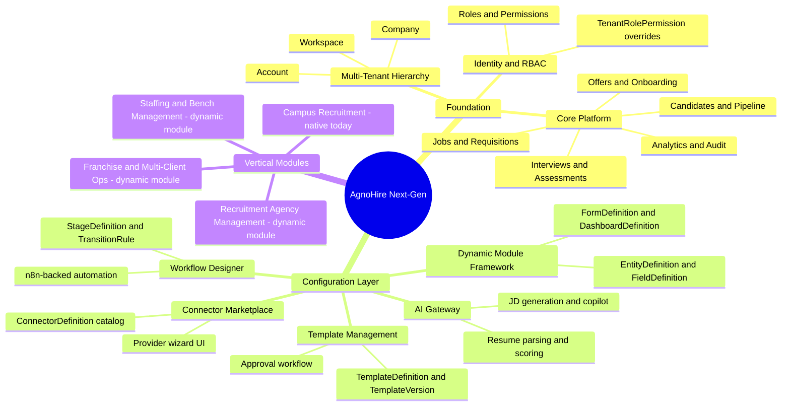

| Layer | Nature | Examples |
|---|---|---|
| Foundation | Hand-built, optimized UX, unchanged in spirit | Jobs, Candidates, Pipeline, Interviews, Offers, Analytics, Audit, RBAC |
| Configuration layer | New metadata-driven capabilities that configure the foundation | Workflow Designer, Connector Marketplace, Template Management, Dynamic Module Framework, AI Gateway |
| Vertical modules | Business-specific verticals; native where they exist today, dynamic-module-composed going forward | Campus Recruitment (native), Recruitment Agency Management, Staffing, Franchise operations (all dynamic-module) |

---

## 3. Application Architecture

AgnoHire stays a modular monolith at its core: routes → controllers → services in `server/src`, fronted by the React SPA. Next-gen adds three new layers underneath/beside it — the Dynamic Module runtime, the n8n integration layer (Workflow Designer backend + webhook gateway), and the AI Gateway — without disturbing the existing request path for native modules.

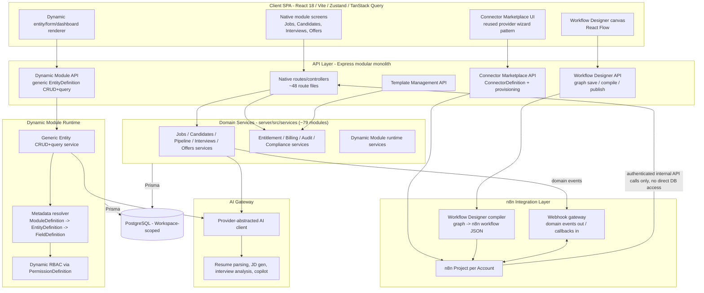

---

## 4. Infrastructure Architecture

The move from Docker Compose to Kubernetes introduces Deployments for the new distributed pieces (n8n main + workers, webhook gateway) alongside the existing web/api containers, while stateful services move to managed offerings for backup/DR guarantees.

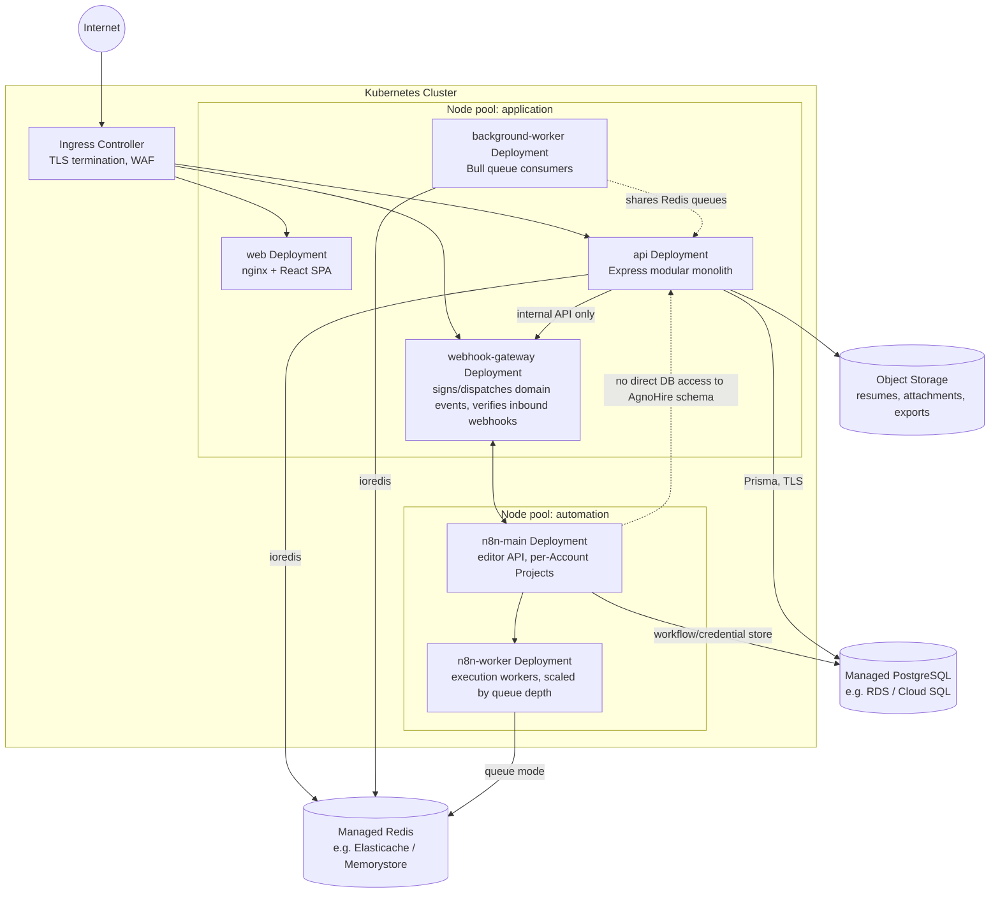

| Component | K8s object | Notes |
|---|---|---|
| web | Deployment + Service | Static SPA, unchanged from Compose today |
| api | Deployment + Service, HPA | Existing modular monolith, containerized |
| n8n-main | Deployment + Service | n8n Enterprise, Projects feature, editor API only reachable internally |
| n8n-worker | Deployment, HPA on queue depth | Execution workers for provisioned workflows |
| webhook-gateway | Deployment + Service | New component; sole path between AgnoHire domain events and n8n |
| background-worker | Deployment | Existing Bull consumers, lifted out of the api process |
| Postgres | Managed service (not in-cluster) | RLS-enforced, `agnohire_app` restricted role for app traffic |
| Redis | Managed service (not in-cluster) | Queues, rate limiting, token revocation |
| Object storage | Managed bucket | Resumes/attachments/exports, replacing in-DB file bytes where applicable |

---

## 5. Integration Architecture

The Connector Marketplace is the catalog and provisioning layer; n8n is the execution engine; the webhook gateway is the sole, audited boundary between AgnoHire's domain and each Account's isolated n8n Project.

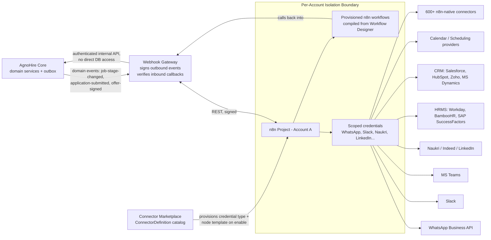

The 20 existing provider wizards (`client/src/pages/admin/integrations/providers/`) map one-to-one onto seed `ConnectorDefinition` entries; enabling one for an Account provisions the matching n8n credential type into that Account's Project and reuses the existing `IntegrationProviderDef` (`getWizardSteps`/`getDefaultState`/`getSavePayload`) UI pattern client-side. New bespoke connectors follow the same wizard-authoring pattern; connectors n8n already ships natively need no AgnoHire application-code change.

---

## 6. Security Architecture

Security is a layered pipeline, each layer independently enforced. The current `agnohire_app` restricted-role + RLS design is **extended to key off `workspaceId`, not replaced** — same defense-in-depth shape, new scoping grain, plus one new isolation boundary at the n8n layer.

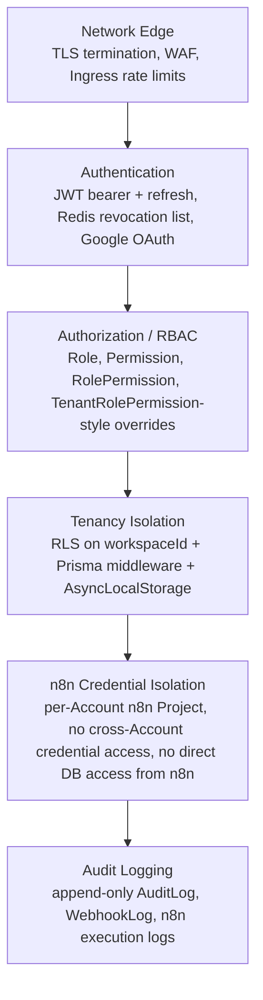

| Layer | Mechanism today | Next-gen extension |
|---|---|---|
| Network edge | TLS outside stack, host nginx/Caddy | Ingress-level TLS + WAF in Kubernetes |
| Authentication | JWT + bcrypt + Passport Google OAuth, Redis revocation | Unchanged; JWT still carries the resolved scope |
| Authorization | Role/Permission/RolePermission + `TenantRolePermission` overrides | Overrides re-keyed to Account/Workspace; `PermissionDefinition` added for dynamic modules |
| Tenancy isolation | `agnohire_app` restricted role, RLS via `app.tenant_id`/`app.bypass`, Prisma `$use` middleware, `AsyncLocalStorage`, subdomain cross-check | Same mechanisms, re-keyed to `app.workspace_id`; `accountId` denormalized on `Workspace` for cross-workspace admin queries |
| n8n credential isolation | N/A (new) | Every Account gets its own n8n Project; credentials never cross Projects; n8n has zero direct AgnoHire DB access — all data flows through the authenticated internal API via the webhook gateway |
| Audit logging | Append-only `AuditLog`, `WebhookLog` | Extended to log Workflow Designer publishes, connector enablement, and n8n execution outcomes |

---

## 7. AI Architecture

The AI Gateway generalizes the existing provider-abstraction pattern (used today for `PaymentProvider`/Razorpay) to AI: every AI-touching feature — including new AI decision nodes inside the Workflow Designer — calls one internal gateway, never a provider SDK directly, and every automated decision carries a human-in-the-loop checkpoint before it can affect a candidate's outcome.

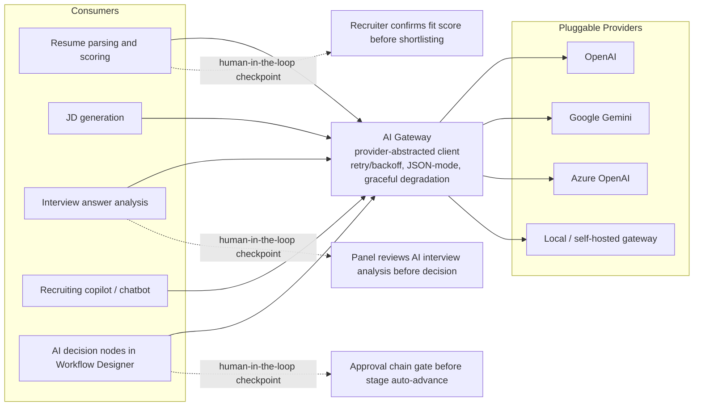

Client-side proctoring ML (face/object detection via TF.js/onnxruntime-web) remains unchanged and orthogonal — it runs entirely in the candidate's browser and never routes through the AI Gateway.

---

## 8. Multi-Tenant Architecture

The tenancy hierarchy grows from a single-level `Tenant` to **Account → Company → Workspace**. `Tenant` is the legacy/internal name for `Account` — the underlying table is extended additively (new columns, new parent/child tables), not broken-renamed. `Workspace` becomes the new scoping grain for the ~33 models that carry `tenantId` today; `accountId` is denormalized onto `Workspace` so Account-level admin/reporting views can query cross-workspace without walking the Company join on every request.

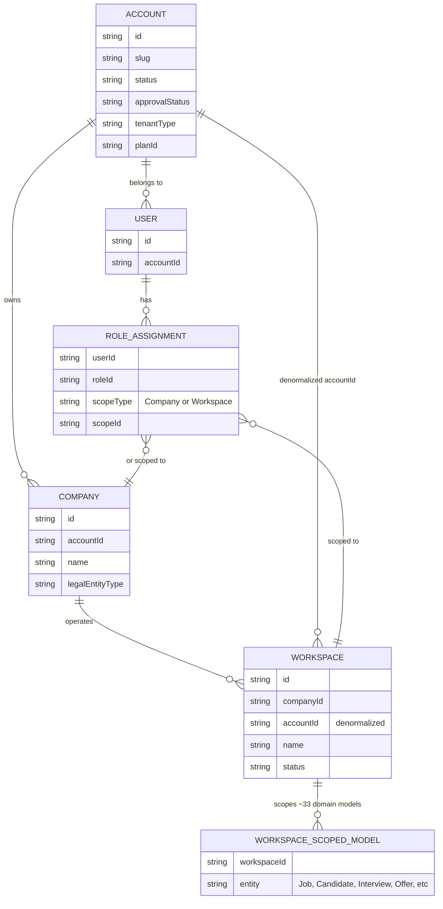

The existing isolation stack — RLS via the restricted `agnohire_app` role, the Prisma `$use` middleware, and `AsyncLocalStorage`-propagated context — keeps its shape and only changes its key: `app.tenant_id` becomes `app.workspace_id`, the `TENANT_MODELS` fail-closed set becomes a `WORKSPACE_MODELS` set, and the JWT carries the resolved `workspaceId` (plus `accountId`) instead of a single `tenantId`. Account-level admins get cross-workspace views by querying on the denormalized `accountId` under an explicit `runAsPlatform()`-style elevated context, exactly as SUPERADMIN/platform operations do today — never through client-supplied headers.

---

## 9. Workflow Architecture

Pipeline customization is split into a native layer (instant, no n8n round-trip) and an n8n-backed automation layer (DAG-grade, for anything beyond a stage rename). The sequence below traces one end-to-end example: a candidate application advancing through a customized pipeline with an AI scoring node and an approval chain.

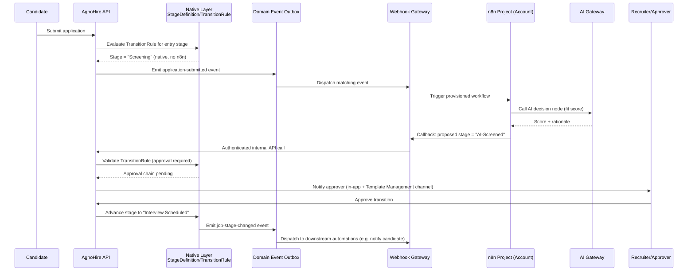

Compilation from the Workflow Designer canvas into a runnable n8n workflow is a one-way, versioned publish step:

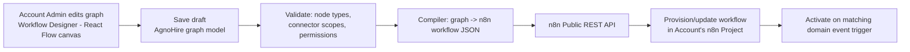

| Layer | Owns | Round-trip | Editable by |
|---|---|---|---|
| Native (`StageDefinition`/`TransitionRule`) | Stage create/rename/reorder, SLA timers, basic approval gates | None — in-process | Drag-and-drop stage editor |
| Automation (n8n-backed) | Notifications, AI decision nodes, branching, parallel execution, escalation | Domain event → webhook gateway → n8n → callback | Workflow Designer canvas |

---

## 10. Metadata Architecture

The Dynamic Module Framework's metadata model is the mechanism by which a whole new vertical module is composed without a code change. `ModuleDefinition` is the root; everything else — entities, fields, forms, dashboards, reports, menus, permissions — hangs off it and is resolved at runtime by the generic Entity CRUD+query service.

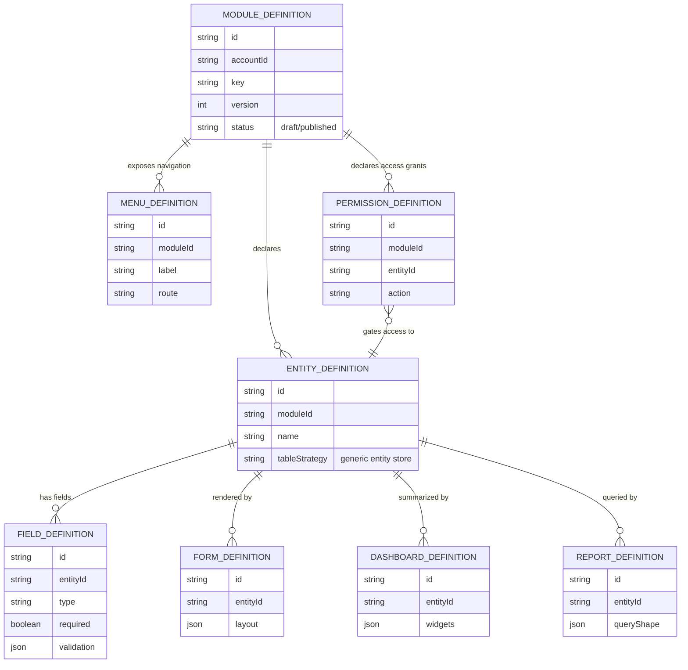

Composing a new vertical — e.g., **Recruitment Agency Management** — is purely metadata authoring, same tenancy scoping and RBAC as native models:

| Step | Metadata produced | No code required because |
|---|---|---|
| Define the module | `ModuleDefinition` (key: `recruitment-agency`, versioned per Account) | Module is a data row, not a route file |
| Model client companies, placements, commission structures | `EntityDefinition` + `FieldDefinition` rows | Generic Entity CRUD+query service handles storage/validation |
| Build the "Client Company" intake form and the "Placements" dashboard | `FormDefinition`, `DashboardDefinition` | Client-side dynamic form/table/dashboard renderer reads the metadata |
| Add a "Placement Fee Report" | `ReportDefinition` | Generic reporting engine resolves `queryShape` against `EntityDefinition` |
| Add "Agency Ops" to the sidebar | `MenuDefinition` | Navigation is metadata-driven, same as menu config today |
| Restrict to Agency Manager role | `PermissionDefinition` | Enforced through the same RBAC middleware as native permissions |

Core recruitment (Jobs/Candidates/Interviews/Offers) is intentionally excluded from this engine and stays native — the Dynamic Module Framework is for net-new business modules only.

---

## 11. Deployment Architecture

CI/CD gains a Kubernetes/Helm deploy stage per environment, with schema migrations gated ahead of traffic cutover — the same "forward-only migration, additive, no breaking rename" discipline already used for the tenancy work extends to the Account/Company/Workspace migration and every new metadata table.

```mermaid
graph LR
    subgraph DEV["Dev"]
        D1[Push / PR] --> D2[Build: api, web, n8n config]
        D2 --> D3[Unit + integration tests]
        D3 --> D4[Helm deploy: dev namespace]
        D4 --> D5[Migration: prisma migrate deploy<br/>additive-only, DIRECT_URL role]
    end

    subgraph STAGE["Staging"]
        S1[Promote build artifact] --> S2[Helm deploy: staging namespace]
        S2 --> S3[Migration gate: staging DB]
        S3 --> S4[E2E + n8n workflow smoke tests]
        S4 --> S5[Manual approval gate]
    end

    subgraph PROD["Production"]
        P1[Promote build artifact] --> P2[Migration gate: prod DB<br/>backward-compatible check]
        P2 --> P3[Helm deploy: rolling update<br/>api, web, n8n-main, n8n-worker, webhook-gateway]
        P3 --> P4[Post-deploy smoke tests]
        P4 --> P5[Traffic fully cut over]
    end

    D5 --> S1
    S5 --> P1
```

---

## 12. Data Flow Diagrams

### 12a. Candidate application lifecycle across modules

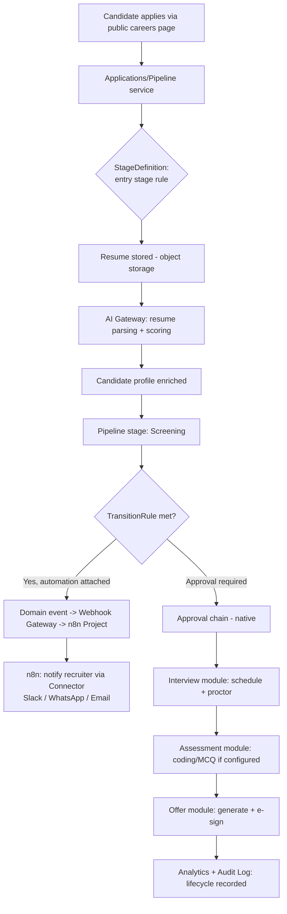

### 12b. Connector-triggered automation: WhatsApp message on stage change

```mermaid
flowchart TD
    A[Recruiter moves candidate to "Interview Scheduled"] --> B[Pipeline service updates stage]
    B --> C[Domain event: job-stage-changed]
    C --> D[Outbox]
    D --> E[Webhook Gateway: sign + dispatch]
    E --> F[Account's n8n Project]
    F --> G{Automation layer:<br/>matching workflow trigger}
    G -->|Yes| H[n8n node: render TemplateDefinition<br/>WhatsApp channel, resolved variables]
    H --> I[Connector credential: WhatsApp Business API]
    I --> J[Message sent to candidate]
    J --> K[n8n callback: delivery status]
    K --> L[Webhook Gateway verifies + forwards]
    L --> M[AgnoHire: WebhookLog + notification record]
```

---

## 13. Sequence Diagrams

### 13a. Publishing a new Workflow Designer automation

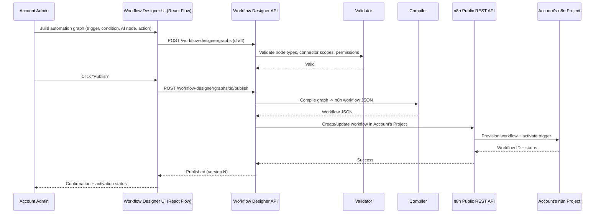

### 13b. Inbound connector webhook updating a pipeline stage

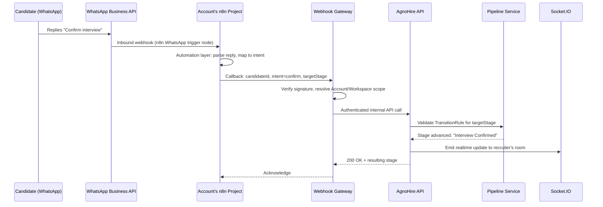

---

## 14. Component Diagrams

This is a finer-grained, software-component view of the same system described topologically in Section 4 — components and their direct call dependencies, not Kubernetes pods.

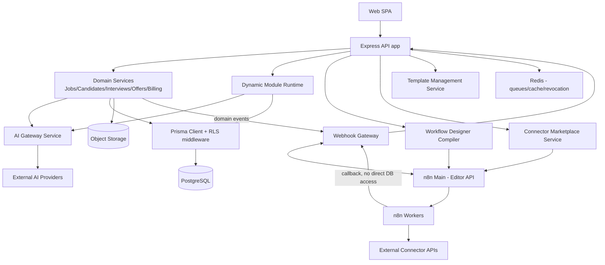

---

## 15. High-Level Design (HLD) Summary

- AgnoHire's modular monolith (Express API + React SPA + `@agnohire/shared` contract package) is the unchanged foundation; every next-gen capability is additive, not a rewrite.
- Tenancy grows from single-level `Tenant` to **Account → Company → Workspace**; `Workspace` becomes the new RLS/Prisma-middleware/`AsyncLocalStorage` scoping grain, with `accountId` denormalized for cross-workspace admin views.
- One centralized, n8n Enterprise instance serves all Accounts; isolation is per-Account **n8n Projects**, never a per-customer install, and tenants never touch the n8n editor UI directly — only the AgnoHire **Workflow Designer**.
- The **webhook gateway** is the single, audited boundary between AgnoHire's domain and n8n: domain events go out signed, n8n calls back into AgnoHire's authenticated internal API, and n8n never gets direct database access.
- Pipeline customization splits into a native, always-on layer (`StageDefinition`/`TransitionRule`) for structure and a n8n-backed automation layer for anything DAG-shaped — notifications, AI decisions, branching, escalation.
- The **Connector Marketplace** generalizes the 20 existing provider wizards into a `ConnectorDefinition` catalog; enabling a connector provisions the matching n8n credential type into the Account's Project.
- The **Dynamic Module Framework** (`ModuleDefinition` → `EntityDefinition` → `FieldDefinition` → Form/Dashboard/Report/Menu/Permission definitions) lets entirely new vertical modules ship as configuration; core recruitment stays native and hand-built.
- The **AI Gateway** is a provider-abstracted layer (same pattern as the existing `PaymentProvider` abstraction) fronting resume parsing, JD generation, interview analysis, and copilot — with human-in-the-loop checkpoints wherever an AI decision affects a candidate outcome.
- **Template Management** generalizes the existing Email Templates admin page to multi-channel, versioned, approval-gated templates resolved against per-event context schemas.
- Deployment moves from Docker Compose to **Kubernetes**: new Deployments for `n8n-main`, `n8n-worker`, and `webhook-gateway` join `web`/`api`/`background-worker`; Postgres and Redis move to managed services.

---

## 16. Low-Level Design (LLD) Pointers

The Technical Spec (`docs/NEXTGEN_TSD.md`) carries the implementation-level detail for each area above; use it, not this document, when you need field-level schemas, API contracts, or algorithmic detail. Section numbers below should be cross-checked against the TSD's final table of contents once published.

- **Account/Company/Workspace data model, migration plan, RLS re-keying** — TSD section on the multi-tenant hierarchy and tenancy migration.
- **n8n Project provisioning, workflow JSON compilation, webhook gateway signing/verification protocol** — TSD section on the n8n integration layer.
- **`ConnectorDefinition` schema, credential-type mapping, provider-wizard migration from the 20 existing integrations** — TSD section on the Connector Marketplace.
- **`ModuleDefinition`/`EntityDefinition`/`FieldDefinition` schemas, generic Entity CRUD+query service, dynamic RBAC via `PermissionDefinition`** — TSD section on the Dynamic Module Framework.
- **`TemplateDefinition`/`TemplateVersion` schema, approval state machine, per-event template context resolution** — TSD section on Template Management.
- **AI Gateway provider interface, retry/backoff/JSON-mode contract, human-in-the-loop checkpoint implementation** — TSD section on AI services.
- **`StageDefinition`/`TransitionRule` schema, native pipeline engine, domain event outbox contract** — TSD section on Workflow Architecture / native pipeline layer.
- **Kubernetes manifests, Helm chart structure, node pool sizing, managed Postgres/Redis configuration** — TSD section on infrastructure and deployment.
- **CI/CD pipeline stages, migration gating strategy, rollback procedure** — TSD section on deployment architecture.
- **Security control implementation detail (RLS policies, Prisma middleware internals, n8n credential isolation enforcement)** — TSD section on security architecture.
