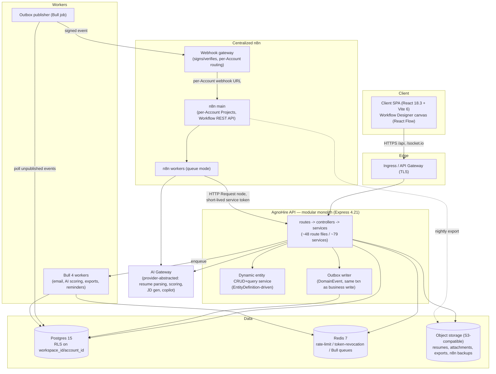
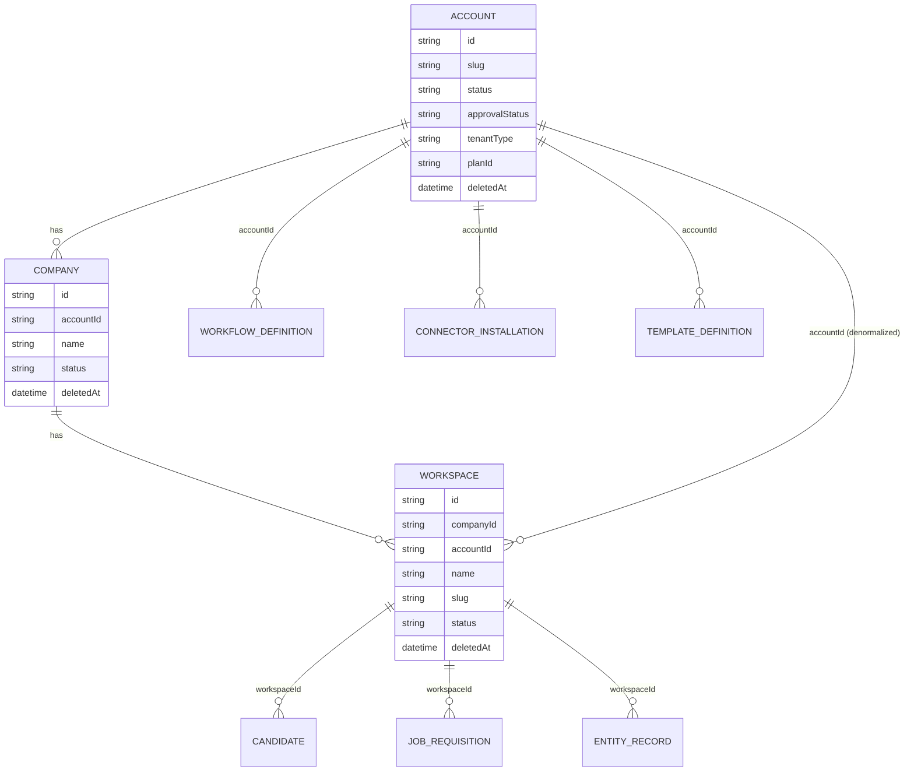

# AgnoHire Next-Gen — Technical Specification Document (TSD)

**System**: AgnoHire Next-Gen — evolution of the live AgnoHire ATS/recruitment SaaS platform into a
configurable, n8n-powered platform (Workflow Designer, Connector Marketplace, Dynamic Module
Framework, Template Management, AI Gateway).

**Basis**: This document describes an **additive evolution**, in the same spirit as
`SAAS_MIGRATION_RUNBOOK.md` — no existing recruitment functionality changes; new capability is
layered on top of the current modular monolith. Companion documents: the Functional Spec (FSD) and
the Solution Blueprint, drafted from the same context pack. Terminology below (Account, Company,
Workspace, Workflow Designer, Connector Marketplace, ConnectorDefinition, Dynamic Module Framework,
EntityDefinition, StageDefinition, TransitionRule, AI Gateway, n8n Project, webhook gateway,
TemplateDefinition) is locked and used consistently with those documents.

---

## 1. System Architecture Overview

AgnoHire today is a single Express 4.21 API process (`server/`) organized `routes → controllers →
services`, ~48 route files and ~79 services by domain module, fronting a Postgres 15 database
through Prisma 5.22, with Redis 7 backing Bull 4 queues, rate limiting and token revocation, and a
React 18.3 SPA (`client/`) consuming the API and a Socket.IO 4.8 realtime channel. Next-gen keeps
this core as-is — **it remains a modular monolith** — and adds four new pieces of distributed
infrastructure around it: a centralized n8n instance (with per-Account n8n Projects), a webhook
gateway that is the sole point of contact between AgnoHire domain events and n8n, an AI Gateway that
centralizes model calls, and a dynamic-module runtime that lives inside the existing API process
(new services/routes, not a new deployable) but is called out separately here because of its
metadata-driven request path.



Two request/event shapes coexist:

- **Synchronous, tenant-facing**: SPA → Ingress → API → Postgres/Redis, exactly as today (JWT-auth'd
  REST, Socket.IO for live updates). The Workflow Designer, Connector Marketplace, and dynamic
  entity/form/dashboard renderers are new screens in the same SPA, calling new route groups on the
  same API process — no new client deployable.
- **Asynchronous, event-driven**: a business write (e.g. `applicationService.moveStage`) writes a
  `DomainEvent` row in the same Prisma transaction as the state change (transactional outbox); a
  Bull-based publisher drains the outbox and hands matching events to the webhook gateway, which
  signs and delivers them to the correct Account's n8n Project webhook. n8n workflows call back into
  AgnoHire over the internal API using short-lived service tokens — **n8n never touches Postgres
  directly**, preserving the existing tenancy boundary.

## 2. Technology Stack

| Layer | Current (verified in repo) | Next-Gen addition | Why |
|---|---|---|---|
| Runtime | Node 20 ESM | — | unchanged |
| API framework | Express 4.21 | + internal-only router namespace (`/api/internal/v1`) | isolates n8n callback surface from tenant API versioning |
| ORM/DB | Prisma 5.22 on Postgres 15 | additive models (Account/Company/Workspace, Connector*, Template*, Stage/TransitionRule, Workflow*, metadata models) | same tooling, no new DB engine |
| Cache/queue | Redis 7 (ioredis), Bull 4 + bull-board | dedicated Redis logical DB (or instance) for n8n queue mode | n8n's own queue-mode workers use a Redis/Bull-compatible queue; isolating it from the app's rate-limit/session Redis avoids one noisy neighbor starving the other |
| Realtime | Socket.IO 4.8 | unchanged; workflow/execution status pushed over existing socket channel | reuse, no new realtime transport |
| Auth | JWT (jsonwebtoken+bcrypt), Passport Google OAuth | service-token type for n8n callbacks, webhook HMAC signing | extends existing JWT machinery rather than introducing OAuth2/mTLS machinery |
| Validation | Zod, `@agnohire/shared` | Zod schemas for `graphJson`, `configSchema`, `variablesSchema` payloads | keeps contract-first pattern for all new JSON blobs |
| Logging | Winston | correlation/trace-id propagation across the AgnoHire↔n8n boundary | needed once execution crosses a process boundary |
| Billing | Razorpay + `PaymentProvider` abstraction | AI Gateway uses the same provider-abstraction shape | proven pattern in this codebase for swappable external providers |
| Client | React 18.3, Vite 6, Zustand+TanStack Query, Tailwind 3.4+CVA+Headless UI, react-hook-form+Zod, Recharts | **React Flow** for the Workflow Designer canvas; generic dynamic-form/table/dashboard renderer components | React Flow is the de facto library for node/edge graph editors in a React codebase already committed to this component stack; a generic renderer is the client half of the Dynamic Module Framework |
| Workflow engine | none | **n8n (Enterprise)** — centralized, one instance, per-Account Projects | reuses 600+ built-in n8n nodes/credential types instead of hand-building an automation engine; Enterprise tier's Projects feature is what makes single-instance multi-tenant isolation viable |
| Event delivery | none | transactional outbox table (`DomainEvent`) + **webhook gateway** service | standard pattern for reliably bridging a monolith's DB transactions to an external system without dual-write risk |
| Object storage | local/volume (implied by Docker Compose) | **S3-compatible object storage** | needed for resume/attachment storage at Kubernetes scale (no persistent host volume to bind), and for n8n workflow/credential-metadata export backups |
| Managed data services | Compose Postgres/Redis | managed Postgres (RDS/Cloud SQL-class) + managed Redis (Elasticache/Memorystore-class) | DR (automated backups, PITR, multi-AZ) that a Compose container cannot provide |
| Deployment | Docker Compose | **Kubernetes + Helm** | see §11 |

## 3. Microservice/Modular Boundaries

The core stays a modular monolith. This is a deliberate choice, not a default:

- The existing `server/src` layout already demonstrates the monolith scales along domain
  boundaries — ~48 route files and ~79 services span Jobs, Candidates, Applications/Pipeline,
  Interviews, Offers, Assessments, Analytics, Audit, Compliance/GDPR, Admin, SaaS/Billing, and the
  full Campus/University module, with a shared `@agnohire/shared` contract package keeping
  client/server types in lockstep. Splitting this into services would multiply deployment surfaces
  and cross-service transactions (e.g. "move application to Offer stage" already touches
  `JobApplication`, `PipelineNote`, `Offer`, `AuditLog`, and `Notification` in one Prisma
  transaction) for no scaling benefit the monolith doesn't already provide via horizontal pod
  replication.
- What genuinely needs to be a separate deployable is infrastructure with a **different runtime,
  different scaling curve, or a different trust boundary** from the API:
  - **n8n** — a third-party product with its own process model, its own queue-mode worker pool, and
    (crucially) a trust boundary: it must never hold direct DB credentials.
  - **Webhook gateway** — a thin, stateless service whose only job is to authenticate outbound
    domain events to n8n and authenticate/validate inbound webhook deliveries; keeping it out of the
    API process means a webhook-delivery incident (retry storms, a slow downstream n8n Project)
    cannot degrade tenant-facing API latency, and it can be scaled/rate-limited independently.
  - **Background workers** — the existing Bull 4 consumers (email, AI scoring, exports) move from
    in-process job handlers to their own Deployment so request-serving API pods are never starved by
    queue-draining CPU/IO. This is a packaging change, not a rewrite: the same `server/src/queues/*`
    job definitions run in a worker-only entrypoint.

**Boundary contracts:**

| Boundary | Direction | Contract |
|---|---|---|
| API → webhook gateway | outbound event | Internal HTTP call, service-to-service bearer token (see §8), JSON body validated against a versioned `DomainEvent` schema (`eventType`, `accountId`, `workspaceId`, `entityType`, `entityId`, `payload`, `occurredAt`, `eventId`) |
| Webhook gateway → n8n | outbound delivery | HTTPS POST to the Account's n8n Project webhook URL, `X-AgnoHire-Signature` (HMAC-SHA256 over body+timestamp+nonce with a per-Account secret), `X-AgnoHire-Trace-Id` |
| n8n → API | callback | HTTPS to `/api/internal/v1/*`, `Authorization: Bearer <service token>` scoped to one `accountId`/`workspaceId`, distinct from tenant-facing `/api/*` versioning so n8n-authored workflows can pin to a stable internal contract independent of tenant API changes |
| API → background workers | job dispatch | unchanged Bull 4 job payloads over Redis; no new contract, just a new consumer process |

## 4. n8n Integration Architecture

**Isolation model.** One AgnoHire-managed n8n Enterprise instance. Every `Account` gets its own **n8n
Project**, which scopes that Account's workflows and credentials away from every other Account on
the same instance. Tenants never see the n8n editor UI — all authoring happens in AgnoHire's own
**Workflow Designer**, a React Flow canvas embedded in the admin app with a simplified, co-branded
node palette (triggers = domain events; actions = notify/approve/AI-decision/branch/call-connector;
no raw "arbitrary n8n node" exposure).

**Provisioning flow** (Workflow Designer → n8n):

1. The designer's graph (nodes + edges + per-node config) is saved as `WorkflowDefinition.graphJson`
   via the API — this is a **draft**, no n8n side effect yet.
2. On **Publish**, a `workflowCompilerService` translates `graphJson` into n8n workflow JSON: each
   designer node maps to a concrete n8n node type (a trigger node becomes an n8n Webhook node bound
   to the gateway's per-workflow path; a "call connector" node becomes the n8n node/credential pair
   registered for that `ConnectorDefinition`; an "AI decision" node becomes an HTTP Request node
   targeting the AI Gateway).
3. The compiled JSON is pushed via the **n8n public REST API** (`POST /workflows`, credential
   attach, `POST /workflows/:id/activate`) into the Account's n8n Project. `WorkflowDefinition`
   stores the resulting `n8nProjectId` and `compiledN8nWorkflowId`.
4. Re-publishing bumps `WorkflowDefinition.version` and updates the same n8n workflow in place;
   disabling a workflow deactivates it in n8n without deleting execution history.

**Credential scoping.** Each `ConnectorDefinition` declares an `n8nCredentialType` (n8n's native
credential type for connectors n8n supports out of the box, or a bespoke HTTP/OAuth2 credential
definition for ones that aren't). Installing a connector for an Account (`ConnectorInstallation`)
creates a credential inside that Account's n8n Project via the n8n API and shares it only within
that Project — n8n Enterprise's project-level credential sharing is what makes "one shared instance,
hard per-Account isolation" possible without provisioning a new n8n install per customer.
`ConnectorInstallation` stores only a reference (`n8nCredentialId`) and non-secret config; the actual
secret material lives inside n8n's encrypted credential store, never in the AgnoHire database.

**Domain events → n8n (outbox → gateway → webhook).** A business-logic write (e.g.
`pipelineService.transitionStage`) writes its normal rows plus a `DomainEvent` row, in the *same*
Prisma transaction, so the event can never be lost or duplicated relative to the state change. A
Bull job (`outboxPublisher`) polls unpublished `DomainEvent` rows, marks them dispatched, and calls
the webhook gateway. The gateway looks up which of the Account's *published* `WorkflowDefinition`s
subscribe to that `eventType`, HMAC-signs the payload with that Account's webhook secret, and POSTs
it to the matching n8n webhook URL. Delivery failures are retried with backoff; every attempt is
recorded for the execution-monitoring view in §13.

**n8n calling back into AgnoHire.** Inside a workflow, an HTTP Request node is configured with a
short-lived **service token** (issued for that `accountId`/`workspaceId`, fixed limited permission
set, a few minutes TTL — see §8) as its credential, and targets
`/api/internal/v1/...`. That router reuses the *existing* service layer end to end — the same
tenancy enforcement (AsyncLocalStorage + RLS) applies to a service-token-authenticated request as to
a user-authenticated one; n8n gets no DB access of any kind, only whatever the internal API
explicitly exposes (e.g. "send offer letter", "read candidate summary", "post a pipeline note").

**Execution/error monitoring.** n8n execution results (success/error, duration, node-level errors)
are pulled into a `WorkflowExecutionLog` row per execution (via n8n's execution API/webhook), keyed
to `WorkflowDefinition` and the originating `DomainEvent`'s trace id, surfaced in an Admin ›
Automation Health view per Account, with failures routed through the existing notification pipeline.

**Horizontal scaling.** n8n runs in **queue mode**: an `n8n-main` Deployment handles the REST
API/webhook intake and Project/credential management; a separate `n8n-worker` Deployment pool
executes workflow runs off a Redis-backed queue, scaled independently (HPA on queue depth) from both
`n8n-main` and the AgnoHire API. Recommendation: give n8n its own Redis logical database (or
instance) distinct from the app's rate-limiting/session/Bull Redis, so a workflow backlog on one
noisy Account cannot degrade `express-rate-limit` or token-revocation checks on the tenant API path.

**Example flow — candidate moved to Offer stage, triggering an approval-chain workflow that sends
the offer letter:**

```mermaid
sequenceDiagram
    participant R as Recruiter (SPA)
    participant API as AgnoHire API (pipeline service)
    participant DB as Postgres (DomainEvent outbox)
    participant PUB as Outbox publisher (Bull job)
    participant GW as Webhook gateway
    participant N8N as n8n (Account Project workflow:\n"Offer Approval Chain")
    participant OFF as AgnoHire API (offer service)

    R->>API: PATCH /api/applications/:id/stage {stage: OFFER}
    API->>DB: Tx: update JobApplication.stage + insert DomainEvent(application.stage_changed)
    DB-->>API: commit
    API-->>R: 200 OK
    PUB->>DB: poll unpublished DomainEvent rows
    DB-->>PUB: application.stage_changed (accountId, workspaceId, applicationId)
    PUB->>GW: POST /dispatch (signed, service token)
    GW->>GW: resolve subscribing WorkflowDefinition for Account+eventType
    GW->>N8N: POST <Account Project webhook URL>\nHMAC signature + trace id
    N8N->>N8N: run approval-chain nodes\n(notify hiring manager, wait-for-approval, branch)
    N8N->>OFF: POST /api/internal/v1/offers/:applicationId/send-letter\nBearer <service token, accountId+workspaceId scoped>
    OFF->>DB: generate offer letter, update Offer, insert AuditLog
    OFF-->>N8N: 200 OK {offerId, documentUrl}
    N8N->>DB: (via execution API pull) WorkflowExecutionLog recorded
```

## 5. Metadata-Driven Design & Dynamic Module Framework

**Metadata schema (new Prisma models, all Account-scoped and versioned):**

- `ModuleDefinition` — `key`, `label`, `icon`, `accountId`, `status` (DRAFT/PUBLISHED), `version`.
  Top-level grouping (e.g. "Staffing Agency Client Management").
- `EntityDefinition` — `moduleId` FK, `key`, `label`, `storageStrategy` (currently only the JSONB
  hybrid, see below), `version`, `status`.
- `FieldDefinition` — `entityId` FK, `key`, `dataType` (string/number/boolean/date/enum/relation),
  `validation` (JSON, Zod-shape-compatible), `required`, `unique`, `promoted` (bool),
  `promotedColumn` (nullable — which scalar column on `EntityRecord` this field is materialized
  into when `promoted=true`).
- `FormDefinition` — `entityId` FK, `layout` (sections/fields/conditional-visibility JSON),
  `version`, `status`.
- `MenuDefinition` — sidebar placement, target (`EntityDefinition`/`DashboardDefinition`/report),
  visible-to roles.
- `DashboardDefinition` — widget layout referencing `ReportDefinition`s.
- `ReportDefinition` — filter/group/aggregate query spec over one `EntityDefinition` (or a
  whitelisted native-model view for cross-cutting reporting).
- `PermissionDefinition` — generates permission keys of the shape `entity.<entityKey>.<action>`
  that plug into the *existing* `Permission`/`RolePermission`/`TenantRolePermission` machinery —
  dynamic entities are not a parallel authorization system, they mint rows in the same tables native
  modules use.

**Generic entity CRUD+query service.** A `dynamicEntityService` mirrors the shape of existing
services (e.g. `candidateService`) but is parameterized by `EntityDefinition`/`FieldDefinition`
instead of a hard-coded Prisma model. Records live in one shared `EntityRecord` table:
`id`, `entityDefinitionId`, `workspaceId`, `accountId` (denormalized), `payload` (JSONB, source of
truth), plus a small fixed set of typed promoted columns (`promotedText1..N`,
`promotedNumber1..N`, `promotedDate1..N`, `promotedBool1..N`) that `FieldDefinition.promoted=true`
fields are written into for indexed filtering/sorting at volume, alongside a GIN index on `payload`
for ad hoc JSONB queries. `EntityRecord` is added to the **same** tenancy-scoping set as native
models: it gets a `workspace_id`-keyed RLS policy behind the restricted `agnohire_app` role exactly
like every other table, and it is added to the Prisma middleware's scoping set so reads/writes are
stamped/filtered by `workspaceId` with the same fail-closed behavior — dynamic data gets *no*
special-cased, weaker isolation than `JobRequisition` or `Candidate` get today. RBAC is enforced the
same way: `requirePermission` middleware checks the `PermissionDefinition`-minted key for the target
`EntityDefinition`, resolved through the identical Role/Permission/override resolution as native
routes (§8).

**Versioning.** `ModuleDefinition`/`EntityDefinition`/`FormDefinition` each carry `version` +
`status` (DRAFT/PUBLISHED/ARCHIVED). Edits happen against a draft working copy; **Publish** bumps the
version and is the only thing the runtime renderer and `dynamicEntityService` resolve against at
request time (the published, cached definition — see §10) — in-flight `EntityRecord`s are never
retroactively reinterpreted by an unpublished draft. This mirrors `TemplateVersion`'s
draft→review→approved→published state machine (§6) rather than inventing a second versioning idiom.

**Why core recruitment stays native.** Jobs/Candidates/Applications/Interviews/Offers/Assessments
have deep, hand-tuned UX (kanban pipeline, Monaco-based coding assessments, TF.js/onnxruntime-web
proctoring, offer document portal) and compile-time-typed contracts via `@agnohire/shared` Zod
schemas plus purpose-built indices. Forcing these onto generic JSONB CRUD and a generic renderer
would trade away exactly the type safety, query performance, and bespoke UX that make them good
today, for configurability they don't need (their shape doesn't change per customer). The Dynamic
Module Framework exists for net-new, long-tail business modules (agency/staffing client management,
university-specific workflows beyond what the Campus module already covers, or anything under the
vision's "Fully Configurable Business Platform") that should ship via configuration rather than a
code release.

## 6. Database Design

**Tenancy hierarchy** (new/modified models):



`Account` is the current `Tenant` model, relabeled in the domain model (`slug`, `status`,
`approvalStatus`, `tenantType`, `planId`, billing fields — unchanged fields, additive migration, not
a breaking rename; the underlying table can keep its physical name via `@@map("Tenant")` during
transition and be renamed in a later, purely cosmetic migration). `Company` is new, FK to `Account`.
`Workspace` is new, FK to `Company`, with `accountId` denormalized for fast cross-workspace
Account-level admin/reporting queries without a join through `Company`.

**Migration path (additive, mirrors `SAAS_MIGRATION_RUNBOOK.md`'s discipline):**

1. Add `Company` and `Workspace` tables. For every existing `Tenant`/`Account`, backfill one default
   `Company` and one default `Workspace`.
2. Add a nullable `workspaceId` column (+ index) to each of the ~33 models that currently carry
   `tenantId`. Backfill `workspaceId` = that Account's default Workspace id, joined via the existing
   `tenantId`.
3. Make `workspaceId` `NOT NULL` once backfilled and verified (row-count parity check, see §14). Keep
   `tenantId` as a deprecated, denormalized column for one release cycle for backward compatibility
   with anything not yet migrated, then drop it in a follow-up migration.
4. Extend RLS: add `workspace_id`-keyed policies alongside the existing `tenant_id` policies on each
   table (both can coexist during transition); the transaction-scoped `set_config('app.workspace_id',
   ...)` is added to the same Prisma `$extends` wrapper that already sets `app.tenant_id`/`app.bypass`
   in `server/src/config/database.ts`, still safe under PgBouncer transaction pooling.
5. Extend the Prisma `$use` middleware's `TENANT_MODELS` set into a `WORKSPACE_MODELS` set (superset,
   including all new tables from this section) with the same fail-closed `__none__` sentinel.
6. Extend `AsyncLocalStorage` context (`server/src/config/tenantContext.ts`) to carry
   `{ accountId, companyId, workspaceId }`; `auth.middleware.ts` populates it from a JWT that now
   carries `workspaceId` (and `companyId`) claims alongside the legacy `tenantId` claim during
   transition.

**New models for connectors, templates, dynamic modules, and the Workflow Designer** (cuid ids,
`deletedAt` soft delete, `accountId`/`workspaceId` scoping columns, consistent with this repo's
existing Prisma conventions):

| Model | Key fields |
|---|---|
| `ConnectorDefinition` | `key`, `name`, `category`, `authType`, `configSchema` (JSON), `n8nCredentialType`, `n8nNodeTemplate` (JSON), `icon`, `isBuiltIn`, `status` |
| `ConnectorInstallation` | `accountId`, `connectorDefinitionId`, `n8nCredentialId`, `config` (JSONB, non-secret only), `status`, `installedByUserId`, `deletedAt` |
| `TemplateDefinition` | `accountId`, `workspaceId?`, `key`, `channel` (EMAIL/WHATSAPP/SMS/PUSH), `category`, `triggerEvent`, `status`, `currentVersionId` |
| `TemplateVersion` | `templateDefinitionId`, `version`, `subject`, `body`, `variablesSchema` (JSON), `locale`, `createdByUserId`, `approvedByUserId?`, `publishedAt` |
| `StageDefinition` | `workspaceId`, `key`, `label`, `order`, `slaHours`, `isTerminal`, `deletedAt` |
| `TransitionRule` | `workspaceId`, `fromStageId`, `toStageId`, `requiresApproval`, `approverRoleIds` (string[]), `conditions` (JSON), `deletedAt` |
| `WorkflowDefinition` | `accountId`, `workspaceId?`, `name`, `graphJson` (React Flow nodes/edges), `n8nProjectId`, `compiledN8nWorkflowId`, `status`, `version`, `triggerEventTypes` (string[]), `deletedAt` |
| `WorkflowExecutionLog` | `workflowDefinitionId`, `n8nExecutionId`, `status`, `startedAt`, `finishedAt`, `errorMessage`, `correlationId` |
| `ModuleDefinition` / `EntityDefinition` / `FieldDefinition` / `FormDefinition` / `MenuDefinition` / `DashboardDefinition` / `ReportDefinition` / `PermissionDefinition` | per §5 |
| `EntityRecord` | `entityDefinitionId`, `workspaceId`, `accountId`, `payload` (JSONB), `promotedText1..N` / `promotedNumber1..N` / `promotedDate1..N` / `promotedBool1..N`, `createdByUserId`, `deletedAt` |
| `DomainEvent` | `accountId`, `workspaceId`, `eventType`, `entityType`, `entityId`, `payload` (JSON), `dispatchedAt`, `occurredAt` |

## 7. API Design

New capabilities follow the existing `routes → controllers → services` convention and REST-ish query
conventions (pagination/sort/filter query params matching current list endpoints, e.g. Candidates/
Jobs):

- **Workflow Designer** — `GET/POST /api/workflows`, `GET/PUT /api/workflows/:id`,
  `POST /api/workflows/:id/publish`, `POST /api/workflows/:id/disable`,
  `POST /api/workflows/:id/test-run`, `GET /api/workflows/:id/executions`.
- **Connector Marketplace** — `GET /api/connectors` (catalog from `ConnectorDefinition`),
  `POST /api/connectors/:key/install`, `PUT /api/connector-installations/:id`,
  `DELETE /api/connector-installations/:id`, `POST /api/connector-installations/:id/test` — reuses
  the existing `IntegrationProviderDef` wizard UI pattern (`getWizardSteps`/`getDefaultState`/
  `getSavePayload`) client-side for connector configuration screens.
- **Dynamic entities** — generic, metadata-driven: `GET/POST /api/entities/:entityKey`,
  `GET/PUT/DELETE /api/entities/:entityKey/:id`, `POST /api/entities/:entityKey/query` (filter/sort/
  paginate body, since dynamic filter shapes don't fit cleanly in query strings). One controller/
  service pair handles every `EntityDefinition`, resolving the definition by `entityKey` +
  `workspaceId` before validating the payload against its `FieldDefinition`-derived Zod schema.
- **Templates** — `GET/POST /api/templates`, `GET/PUT /api/templates/:id`,
  `POST /api/templates/:id/versions`, `POST /api/templates/:id/versions/:version/submit-review`,
  `.../approve`, `.../publish`, `POST /api/templates/:id/preview` (resolves `variablesSchema` against
  a sample "template context" for the chosen `triggerEvent`).
- **Internal n8n callback namespace** — `/api/internal/v1/*`, a separate Express router mounted
  independently of tenant-facing `/api/*`, so its contract can be versioned on its own cadence
  (workflows published against `v1` keep working even as tenant-facing endpoints evolve). Every
  route here requires a `service`-type token (§8) rather than a user JWT, and is otherwise
  implemented with the same controller/service pattern, calling straight into existing services
  (e.g. `offerService.sendOfferLetter`) so there is no parallel business-logic implementation for
  the n8n path.

## 8. Authentication & Authorization

**Claim shape.** The JWT gains `accountId`, `companyId` (nullable), and either an `activeWorkspaceId`
plus the set of `workspaceIds` the user can switch into, or a per-request workspace header validated
against that set (mirroring today's subdomain-vs-JWT cross-check, extended to workspace switching).
`tokenType` distinguishes `user`, `service`, and the existing `impersonation` flag.

**Effective permission resolution** now spans three scopes, resolved in order and unioned/overridden
top-down at login/refresh (and re-resolved on workspace switch, cached per session):

1. Base `Role` → `Permission` via `RolePermission`.
2. Account-level overrides — the existing `TenantRolePermission` table, re-keyed to `accountId`.
3. Workspace-level overrides — a new `WorkspaceRolePermission` table, same shape, for cases where a
   Workspace needs a narrower or broader grant than its Account default (e.g. an agency's client
   Workspace restricting `PANEL_MEMBER` further than the Account default).

`requirePermission`/`requireAnyPermission`/`requireRole` middleware is unchanged in shape but now
also accepts the dynamic `entity.<entityKey>.<action>` keys minted by `PermissionDefinition` (§5).
`SUPERADMIN` continues to bypass all checks; `runAsPlatform()`/`bypass: true` remains reserved for
platform operations and is extended to operate at the Account level (its natural equivalent to
today's Tenant level).

**Service-to-service auth (n8n → API).** A dedicated internal token endpoint issues **service
tokens**: short TTL (minutes), scoped to exactly one `accountId`+`workspaceId`, a fixed limited
permission set (only the internal operations that workflow node types are allowed to call — e.g.
"send offer letter", "post pipeline note" — never full CRUD), `tokenType: 'service'`, cannot mint
further tokens, cannot carry `bypass`. The credential used to obtain a service token (a per-Account
client secret) is stored as an n8n credential inside that Account's Project, attached to the HTTP
Request node that calls back — so leaking one Account's automation credential cannot be used against
another Account's data.

**Webhook gateway auth.** Outbound (AgnoHire → n8n): HMAC-SHA256 signature over
body+timestamp+nonce using a per-Account webhook secret (rotatable independent of that Account's n8n
credentials). Inbound where applicable: same scheme, verified against the same secret, with the
nonce/timestamp also enforcing replay protection (§9).

## 9. Security

The existing defense-in-depth is **extended in grain, not replaced**:

- **RLS** — the app still connects as the restricted `agnohire_app` role (`NOSUPERUSER
  NOBYPASSRLS`); the transaction-scoped `set_config` pattern in `server/src/config/database.ts`
  additionally sets `app.workspace_id`/`app.account_id` alongside `app.tenant_id`/`app.bypass`
  during the migration window, then keys exclusively on `workspace_id` once the cutover completes.
  Every new table introduced in §6 (`EntityRecord`, `WorkflowDefinition`, `ConnectorInstallation`,
  `TemplateDefinition`, etc.) gets a `workspace_id`/`account_id` RLS policy from the day it's
  created — there is no new table that skips this. The separate `DIRECT_URL` superuser/owner role
  remains migrations-only, never used for app traffic.
- **Prisma middleware** — `TENANT_MODELS` becomes `WORKSPACE_MODELS`, a superset including every
  new model, same fail-closed `__none__` sentinel behavior for principals with no workspace in
  scope.
- **AsyncLocalStorage** — context object gains `accountId`/`companyId`/`workspaceId`, still
  populated only from the verified JWT, never from client-supplied headers; subdomain-to-JWT
  cross-checking extends naturally to Workspace-aware routing.
- **n8n credential isolation** — n8n Enterprise Project-scoped credential sharing means Project A's
  credentials are invisible to Project B's workflows even though both run on the same instance;
  credentials are encrypted at rest by n8n using its own encryption key, managed as a Kubernetes
  secret. AgnoHire's own database never stores raw third-party connector secrets — only the
  non-secret `config` and an `n8nCredentialId` reference on `ConnectorInstallation`.
- **Webhook signing/replay protection** — HMAC-SHA256 signature + timestamp + nonce on every
  gateway↔n8n hop; the gateway rejects events with a timestamp older than a short window (e.g. 5
  minutes) or a previously-seen `eventId`/nonce (tracked in Redis for fast idempotent rejection).
- **Secrets management** — AgnoHire's own secrets (DB credentials, JWT signing keys, Razorpay keys)
  continue via environment/Kubernetes secrets; new secrets introduced are the n8n API key
  (server-side only, used for provisioning) and per-Account webhook signing secrets, stored
  encrypted at rest in the AgnoHire database, never exposed to the client or to n8n workflow output.
- **Audit logging** — the existing append-only `AuditLog` model/service is extended to log
  `WorkflowDefinition` publish/disable, `ConnectorInstallation` install/update/remove,
  `TemplateVersion` approve/publish, and `StageDefinition`/`TransitionRule` edits, using the same
  audit pipeline that already covers other admin actions — no parallel audit mechanism.

## 10. Performance & Scalability

- **Connection pooling** — PgBouncer stays in place in transaction-pooling mode; the
  `set_config`-per-transaction RLS pattern is explicitly compatible with this (session-scoped
  `set_config` would leak context across pooled connections — this is why the current
  implementation is transaction-scoped, and that constraint carries forward unchanged as the scoping
  key becomes `workspace_id`).
- **Read replicas** — Account-level cross-workspace reporting/dashboard queries (`ReportDefinition`
  execution, Account admin rollups) are routed to a read replica rather than the primary, since they
  are the queries most likely to scan across many Workspaces at once.
- **n8n queue-mode scaling** — `n8n-worker` pods scale via HPA on queue depth (or a KEDA
  Redis-queue-depth scaler), independent of `n8n-main` and independent of the AgnoHire API's own
  scaling.
- **Dynamic-module metadata caching** — published `ModuleDefinition`/`EntityDefinition`/
  `FormDefinition` are cached per Account in Redis with a short TTL and explicit invalidation on
  Publish, following the same cache-with-invalidation shape already used for admin-configurable
  settings (System Configuration) — the generic renderer and `dynamicEntityService` should not
  re-resolve metadata from Postgres on every request.
- **Rate limiting** — `express-rate-limit` + Redis stays the mechanism; new heavy endpoints
  (dynamic entity `query`, connector `test`, workflow `test-run`) get limiter keys that include
  `accountId`/`workspaceId` so one Account's automation testing cannot starve shared API or n8n
  capacity from others.

## 11. Deployment Strategy & Kubernetes

Moving off Docker Compose to Kubernetes, per service:

| Deployment | Notes |
|---|---|
| `api` | existing server image, now stateless/multi-replica behind an Ingress, HPA on CPU + request rate |
| `web` | nginx+SPA static container, unchanged build, optionally CDN-fronted |
| `worker` | the existing Bull 4 job consumers, split out of the API process into their own Deployment so queue-draining load never competes with request-serving pods |
| `n8n-main` | webhook intake + Project/credential/workflow REST API; **internal-only** — no public Ingress path for tenant traffic, reachable only by the API and the webhook gateway |
| `n8n-worker` | queue-mode execution workers, HPA on queue depth |
| `webhook-gateway` | new stateless service, HPA on request rate |

Managed Postgres (RDS/Cloud SQL-class) and managed Redis (Elasticache/Memorystore-class) replace the
in-Compose containers, with PgBouncer continuing to front Postgres (managed pooler or sidecar). A
**separate Redis instance/logical DB** is recommended for n8n's queue mode versus the app's
rate-limit/session/Bull Redis, per §4/§10. TLS moves from host nginx/Caddy termination to an Ingress
controller + cert-manager; `n8n-main` and `webhook-gateway` get NetworkPolicies restricting inbound
traffic to the API and to each other, never directly internet-exposed. Helm charts are per-service
(`charts/api`, `charts/web`, `charts/worker`, `charts/n8n`, `charts/webhook-gateway`) under a parent
umbrella chart with per-environment values. The `api` Deployment uses a blue/green or canary rollout
(weighted Ingress routing, or Argo Rollouts) — the actual coordination hazard being managed there is
the database migration, gated separately per §14, not the pod rollout itself.

## 12. Disaster Recovery

| Target | RPO | RTO | Mechanism |
|---|---|---|---|
| Postgres (application data) | ≤ 15 min | ≤ 2 h | managed automated backups + point-in-time restore (WAL), multi-AZ standby |
| n8n workflow definitions & credential metadata | ≤ 1 h | ≤ 4 h | scheduled job hitting the n8n REST API to export each Account's Project workflows + credential metadata into object storage nightly/hourly; n8n's own metadata store (recommended: pointed at its own schema on the same managed Postgres cluster) inherits Postgres's backup coverage; raw credential secret material stays inside n8n's own encrypted store/backup, never duplicated into AgnoHire's export |
| Object storage (resumes, attachments, exports) | provider-native (versioning/replication) | — | S3-compatible storage with versioning enabled |

Multi-AZ: managed Postgres/Redis run with multi-AZ standbys; Kubernetes node pools spread across
availability zones; Ingress/load balancer is multi-AZ by default on managed cloud offerings.

## 13. Logging & Monitoring

Winston remains the logging library. What's added is **correlation across the AgnoHire↔n8n
boundary**: each `DomainEvent` carries an `eventId`/trace id that propagates as `X-AgnoHire-Trace-Id`
through the webhook gateway's delivery to n8n, is preserved on the n8n execution, and is echoed back
on the callback into `/api/internal/v1/*` — so a single trace id ties together the original API
write, the outbox dispatch, the n8n execution, and the resulting callback in log aggregation,
without needing a full distributed-tracing rewrite of the core monolith.

Prometheus-style `/metrics` endpoints are added to `api`, `webhook-gateway`, and `n8n` (n8n exposes
built-in Prometheus metrics in queue mode). Grafana dashboards per Account cover: workflow execution
success rate, average/95th-percentile execution duration, failed-execution count, webhook delivery
latency, and n8n queue depth. Failed executions alert through the existing notification pipeline
(the same `Notification`/email path used for other operational alerts today), scoped so an Account's
admin sees their own automation failures without visibility into other Accounts'.

## 14. CI/CD

Today's pipeline (`.github/workflows/ci.yml`) is a single job: `npm ci` → `npm run build`, which
builds the three npm workspaces in dependency order — `shared` (tsc) → `server` (`prisma generate` +
tsc) → `client` (vite build) — a pure compile-check with no live Postgres/Redis and no test
execution (the server test suite is black-box against a live stack and isn't yet wired into CI).
Next-gen adds stages on top of this, not a replacement:

1. **n8n workflow-template lint/validation** — a new CI step validates any checked-in
   `WorkflowDefinition` seed/template `graphJson` against its Zod schema and dry-runs the
   `workflowCompilerService` translation to n8n JSON, the same way `@agnohire/shared` Zod schemas
   already gate cross-tier contracts — catching a malformed designer graph before it can be
   published against a real n8n Project.
2. **Helm chart lint + deploy** — `helm lint` and `helm template` for every chart under `charts/`,
   then package/push and `helm upgrade`/GitOps sync per environment, added as parallel jobs to the
   existing build job so they don't block the compile-check on unrelated infra changes.
3. **Migration gating for `tenantId` → `workspaceId`** — a dedicated CI/CD gate that runs the
   additive migration from §6 against a schema-only copy of production and asserts row-count parity
   (no model in `WORKSPACE_MODELS` may have a null `workspaceId` post-backfill) before the deploy is
   allowed to proceed; making `workspaceId` the enforced RLS/middleware key in production requires a
   manual approval step, following the same "additive, backfill-first, no `migrate reset`" discipline
   `SAAS_MIGRATION_RUNBOOK.md` already established for the original `tenantId` rollout.
